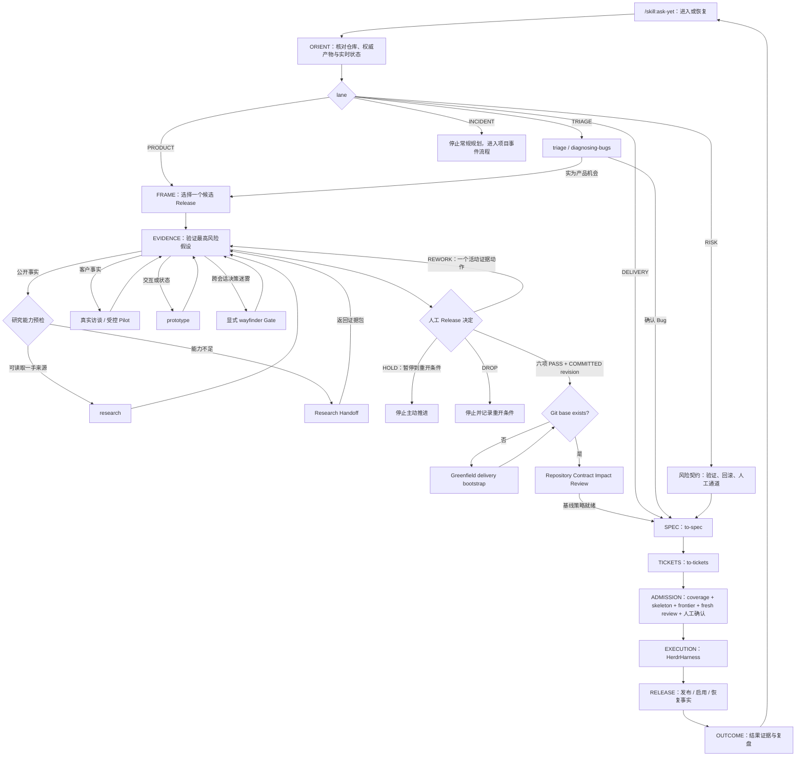

# `/ask-yet`：产品到交付统一入口 Skill 架构

> 状态：Phase 1、Gate C、自动 helper 路由、显式流程分级、五字段人类状态卡、真实模型 Release Gate 和 R001 Release→Harness canary 已完成；十四个只读 fresh-process PI 场景已通过，真实产品证据循环仍未闭环
>
> 日期：2026-08-16
>
> 已确定：唯一入口名为 `/skill:ask-yet`；核心契约必须与任何具体产品解耦；研究能力降级和 repository policy 生命周期采用 fail-closed；Admission 保持现有 fresh review + 人工确认，不增加跨系统封条
>
> 上位运行模型：[从产品意图到可验证结果：全阶段运行方案](./product-to-delivery-operating-model.md)
>
> 产品无关 Release 规则的待提取来源：[原 `/to-release` 架构契约](./to-release-skill-architecture.md)；其中试验实例和 expected result 不进入运行时
>
## 1. 核心决定

`ask-yet` 是 `pi-ticket-plan` 中唯一需要人记住的产品到交付入口：

```text
/skill:ask-yet [可选：想法、问题、Issue、Release Frame 或当前目标]
```

它不是另一个产品阶段，也不是把所有 Skill 内容复制在一起的巨型 Skill。它是控制面：

1. 从当前仓库和权威产物重建真实状态；
2. 判断当前 lane、stage 和下一道 Gate；
3. 一次只推进到一个可验证的下一动作；
4. 在阶段内复用现有研究、访谈、原型和建模能力；
5. 自动调用下游 helper，只在产品、策略、Ticket 图和 Admission 激活等真实人工门停止；
6. 在交付完成后继续追踪 Release outcome，再进入下一轮。

因此：

- 上游 `ask-matt` 在隔离 Profile 中停止暴露，普通 PI 环境不受影响；
- `/to-release` 不再是公开入口，其稳定规则降为 `ask-yet` 的内部 reference；
- `to-spec`、`to-tickets`、`admit-ticket` 和 HerdrHarness 保持各自职责；
- 用户不再回答“该用哪个 Skill”，只回答产品事实、取舍、风险接受和 Gate 决定。

## 2. 为什么需要统一入口

### 2.1 当前真实断点

现有上游 `ask-matt` 是一张静态 Skill 地图，主线是：

```text
idea → grill-with-docs → to-spec → to-tickets → implement
```

它没有产品证据、Release Commitment、Admission、Harness 和 Outcome Review，因此会出现：

- 把“想法已经说清楚”误判成“产品已经值得做”；
- 把多个未知项过早升级为 Wayfinder；
- 把现有 Issue 图和工程状态当作产品方向；
- 直接走向 `/implement`，绕开 `pi-ticket-planning` 的准入与 Harness 事实链；
- 合并后结束，缺少产品结果回流。

单独新增 `/to-release` 也不能解决入口问题：用户仍需先判断应该调用 `ask-matt`、`to-release`、`wayfinder` 还是 `triage`。这把系统应承担的路由成本重新交给了人。

### 2.2 目标 Interface

`ask-yet` 应成为一个深 Interface：人只需知道一个入口和少数高影响决定，内部隐藏完整 Skill 拓扑、证据规则和阶段恢复逻辑。

删除 `ask-yet` 后，这些复杂度会重新散落给每个调用者，说明它有存在价值：

- 当前工作属于什么 lane；
- 处于产品发现还是交付阶段；
- 哪些事实可由 Agent 查，哪些只能由人提供；
- 什么时候使用 research、prototype 或 Wayfinder；
- 什么时候允许进入 Spec、Tickets、Admission 和 Harness；
- 如何从中断状态恢复；
- 何时才能说 Release 有效，而不只是代码合并。

## 3. 成功定义与非目标

### 3.1 成功定义

`ask-yet` 成功，不是因为它输出了长计划，而是因为：

- 人只需记住 `/skill:ask-yet`；
- 裸调用能从当前仓库恢复，而不是要求重述所有背景；
- 每轮只留下一个最小下一动作或一个人工问题；
- 同一冻结事实下，fresh context 给出相同 lane、stage、关键 blocker 和禁止越过的 Gate；
- 未 `COMMITTED` 的 Release 永远不能进入 `to-spec`；
- 未通过 Admission 的 Ticket 永远不能交给 Harness；
- `delivered`、`merged`、`released` 和 `outcome achieved` 始终是四个不同事实；
- Release 结果能回流为下一次候选，而不会自动变成实现 Ticket。

### 3.2 非目标

首版不做：

- 自动产品经理或无需人工判断的产品决策算法；
- 一次性规划完整成熟产品和远期实现 backlog；
- 新工作流引擎、数据库、常驻 Planner、第二套 Reviewer 或通用多 Agent 平台；
- 复制 `research`、`prototype`、`wayfinder`、`to-spec`、`to-tickets` 或 Harness；
- 把任何试验产品的事实、术语或预期答案写入运行时 Skill；
- 用 Issue 数、代码量、Agent 完成率或百分比表示产品成熟度；
- 在没有第二个真实 runtime 前抽取通用包或 adapter interface。

## 4. 完整主循环



发现与交付仍是两个并行闭环，但 `ask-yet` 提供同一进入与恢复方式：

- 一个已承诺 Release 可以在交付；
- 下一个候选 Release 可以做发现；
- 未承诺候选不得进入实现队列；
- Outcome Review 回流后重新从 `ask-yet` 进入。

## 5. Lane、Planning depth、Control mode 与 Stage

### 5.1 Lane：工作为什么进入系统

| Lane | 识别信号 | 默认去向 |
|---|---|---|
| `PRODUCT` | 新产品、高不确定性功能、有界增强、需要决定价值或行为 | `FRAME → EVIDENCE → COMMIT` |
| `DELIVERY` | 已有 `COMMITTED` Release 或明确、受信的交付输入 | `SPEC → TICKETS → ADMISSION → EXECUTION` |
| `TRIAGE` | 已承诺行为失效、外部 Bug/请求、未知类别 Issue，或一张票可表达的决策完整局部修改 | `triage / diagnosing-bugs`，再并回产品或交付 |
| `RISK` | 维护、安全、合规、迁移或平台约束驱动 | 先固定验证、回滚和人工通道，再进入交付 |
| `INCIDENT` | 用户、数据或安全正在受影响 | 停止常规 Release shaping，进入项目事件流程 |

`Wayfinder` 不是 lane。它只是 `FRAME/EVIDENCE` 中无法在一次上下文选出最小证据动作时的跨会话决策手段。

### 5.2 Planning depth 与 Control mode：分别判断需要规划多深、需要控制多严

`ask-yet` 根据当前权威事实自动推断，用户不选择档位。规划深度只有三档：

| Planning depth | 识别信号 | 最短正式路径 |
|---|---|---|
| `QUICK` | 一个 trusted source 已能形成一张决策完整的 `READY/STANDALONE` Ticket | Source → 单 Ticket → fresh Readiness → Admission |
| `STANDARD` | actor、trigger 和目标行为已有可信事实，但仍需 Spec 或多张 Ticket | 同一 Release artifact 的 Release-lite → Spec → Tickets → Admission |
| `DISCOVERY` | 新产品、新角色、新核心流程，或价值/行为未知会改变交付内容 | Frame → Evidence → Commit → Spec → Tickets |

风险控制独立判断为 `NORMAL | CONTROLLED`。安全、隐私、权限、合规、审计、破坏性迁移、高风险生产切换、启用/回滚机制变更、不可逆副作用或大 blast radius 触发 `CONTROLLED`，并在原规划路径上增加适用的证据、审批、回滚和发布门禁。普通可逆部署本身不触发受控模式。它不自动把小修改升级成产品发现：`QUICK + CONTROLLED` 可以保持单 Ticket，但风险契约必须闭合；`DISCOVERY + CONTROLLED` 才同时走完整发现和受控发布。

先识别当前影响中的 `INCIDENT` 并停止普通规划；否则先选择能由权威事实证明的最浅规划深度，再叠加风险控制。不能证明 `QUICK` 或 `STANDARD` 时默认 `DISCOVERY`。两者都不替代 lane、stage、verdict 或授权，并在每次运行中重新推断，不新增权威状态字段。面向用户仍只显示一句“快速/标准/完整发现/受控路径”的决定性解释。

### 5.3 Stage：当前走到哪里

| Stage | 完成条件 |
|---|---|
| `ORIENT` | 目标仓库、lane、当前权威产物和唯一下一 Gate 已确定 |
| `FRAME` | 只剩一个候选 Release，actor、trigger、outcome 和最小闭环可描述 |
| `EVIDENCE` | 最高风险假设有最小证据动作、appetite、阈值和停止条件 |
| `COMMIT` | Readiness 已逐项判断，人的决定已持久化；只有全部 PASS 才能 `COMMITTED`，`HOLD` 暂停到重开条件，`REWORK` 保留一个活动动作 |
| `SPEC` | 已决定行为被编译为 Delivery Spec，无阻塞产品决定 |
| `TICKETS` | 场景覆盖完整，Ticket 是纵向、独立可验收切片 |
| `ADMISSION` | frontier、fresh review、snapshot、有效 repository policy 和人工确认一致；ready 状态已写入 tracker |
| `EXECUTION` | Admission 激活后按 Harness ledger 区分 `HANDOFF_READY/IN_PROGRESS/BLOCKED/DELIVERED` |
| `OUTCOME` | 发布后先等待证据；到 evidence window 后得到结果判定和下一产品决定 |

每个 Stage 使用自己的 verdict，不制造一个混合所有含义的万能状态：

- Product readiness：`READY_TO_COMMIT | NEEDS_RESEARCH | NEEDS_PROTOTYPE | NEEDS_DECISION`
- Commitment：`COMMITTED | HOLD | REWORK | DROP`
- Ticket readiness：`READY | SPLIT | NEEDS_INFO`，另带 `AGENT | HUMAN` lane
- Outcome：`AWAITING_EVIDENCE | ACHIEVED | PARTIAL | NOT_ACHIEVED | UNEVALUABLE`

## 6. 能力清单

| 能力 | `ask-yet` 的行为 | 复用对象 | 人工 Gate |
|---|---|---|---|
| 进入与恢复 | 裸调用解析当前仓库；有 Frame 时读取其 revision 后的新事实 | Git、项目文档、tracker、Harness 只读状态 | 选择或纠正目标 |
| 有界事实重建 | 按来源优先级读取最小材料，区分产品与交付成熟度 | 主上下文；必要时 bounded scout | 私有事实由人提供 |
| Lane 路由 | 判断 PRODUCT/DELIVERY/TRIAGE/RISK/INCIDENT | 内部路由规则 | 人确认有争议的分类 |
| 流程缩放 | 自动推断 QUICK/STANDARD/DISCOVERY 规划深度，再叠加 NORMAL/CONTROLLED 风险控制 | `ask-yet` 内部规则；Release-lite 复用 `release-loop.md` | 人只纠正事实或接受高风险，不选择档位 |
| Release framing | 收敛 actor、trigger、problem、outcome、最小闭环、non-goals 和 appetite | 内部 release-loop reference | 人选择候选赌注 |
| Evidence Ledger | 标记 `FACT/ASSUMPTION/DECISION/UNKNOWN`，保留来源与局限 | Release Frame | 人解释客户证据 |
| 风险扫描 | 检查 VALUE/USABILITY/FEASIBILITY/VIABILITY 与高风险护栏 | release-loop reference | 人接受 appetite 和重大风险 |
| 对话与决策 | 只问会改变下一 Gate 的问题，并给推荐和代价 | `grilling`、`domain-modeling` | 人作取舍 |
| 公开资料研究 | 先固定 Research Contract 并核对能力；可读取时查一手资料，不可读取时输出 Research Handoff | `research`、本地资料或外部研究环境 | 写研究产物或把资料带入环境前确认 |
| 客户证据 | 生成故事访谈或受控 Pilot 协议，不模拟客户答案 | `to-questionnaire` 或最小协议 | 真实客户参与和隐私边界 |
| 原型验证 | 只回答一个交互、状态或业务逻辑问题，写明丢弃条件 | `prototype` | 创建原型前确认 |
| Wayfinder 升级 | 只有相互依赖决定无法在一次上下文收口时提供精确命令 | `wayfinder` | 人显式调用 |
| Release readiness | 使用固定 rubric 给出产品 verdict | release-loop reference | 人决定 `COMMITTED/HOLD/REWORK/DROP`；只有 `COMMITTED` 要求 `READY_TO_COMMIT` |
| Repository contract | Commitment 后判断新决定是否属于稳定跨票约束；必要时起草最小根策略 diff 并先进入基线 | 有效根级 policy、Git exact base SHA | 人审核并合入策略变更 |
| Delivery 编译 | 只把 `COMMITTED` exact revision 和已就绪 repository contract 交给 Spec | `to-spec` | 人显式调用 |
| Ticket 与准入 | 跟踪 scenario coverage、frontier、fresh review 和 execution lane | `to-tickets`、`ticket-readiness`、`admit-ticket` | 发布/激活标签前确认 |
| 执行交接 | Admission 激活后报告 `HANDOFF_READY`；Harness 离线不构成 planning blocker | ready tracker state | 人确认 Admission 状态变更 |
| 执行跟踪 | 按需读取 Harness ledger；领取后 planning 只读，不推断或改写 Harness 状态 | HerdrHarness | Harness 自身恢复门与人工 merge/release 边界 |
| Release 与恢复 | 区分 merged/deployed/released，记录启用、smoke、rollback | 项目发布流程 | 高风险启用和回滚决定 |
| Outcome Review | 到窗口后对结果和护栏给出判定，提出下一候选 | Release Frame / Release Record | 人决定 CONTINUE/ITERATE/PIVOT/STOP |
| 状态可视化 | 每轮显示目标、已确认事实、缺口、停止原因、人类动作和系统后续 | 五字段人类状态卡 + 单行 checkpoint | 无 |

## 7. Skill 拓扑与调用语义

### 7.1 唯一公开控制入口

| 组件 | 角色 | 调用方式 |
|---|---|---|
| `ask-yet` | 产品到交付 Router、状态恢复和下一 Gate 控制面 | 人显式调用；唯一需要记住的入口 |
| `release-loop.md` | Evidence、Release Frame、readiness、Commitment 和 Outcome 规则 | `ask-yet` 在 PRODUCT/OUTCOME 分支按需读取；不是 Skill 命令 |
| `execution-closeout.md` | Admission 后的事实所有权、无 daemon 恢复、交付/发布/Outcome 与父票收尾 | 下游事实存在时由 `ask-yet` 直接按需读取；不是 Skill 命令 |

### 7.2 阶段内辅助能力

`research`、`prototype`、`grilling`、`domain-modeling`、`diagnosing-bugs` 等 model-invoked Skill 可以在对应分支被使用。Skill 可被发现不等于它依赖的工具可用：调用前先核对当前环境实际具备的读取、网络、浏览器、子代理和写入能力。涉及文件、原型、外部系统或真实用户时，仍遵守写入和风险批准边界。

### 7.3 阶段 Gate

`setup-delivery-repository`、`triage`、`to-spec`、`to-tickets` 和 `admit-ticket` 是 model-invoked helper；`ask-yet` 在当前 Gate 匹配时读取其合同并在同一运行中继续。它只在产品选择、策略变更、Ticket 图批准和 Admission 激活等人工 Gate 停止。`wayfinder` 与 `to-questionnaire` 仍是独立的人类交互，确实需要时只输出一个精确命令。

### 7.4 交付执行

产品主线不再以 `/implement` 为默认终点。已准入 Ticket 交给 HerdrHarness；`implement` 只保留给不进入正式队列的明确、低风险局部工作，不作为 `ask-yet` 的产品交付主路径。

## 8. 权威状态与产物

### 8.1 没有候选 Release 时

在用户尚未选定候选前，只保留会话 checkpoint，不自动创建文档。裸调用按以下顺序解析：

1. 用户提供的目标或材料；
2. 当前目标分支 exact base SHA 中按 Harness precedence 生效的唯一根级 repository policy、根 README 和权威产品入口；
3. 已存在的 active Release Frame；
4. 与当前 Gate 直接相关的 tracker、研究、原型、ADR 或 Harness 事实；
5. 无法发现且会改变下一 Gate 的人类输入。

### 8.2 选定候选后

经人批准首次写入后，每个 active Release 只维护一份：

```text
docs/product/releases/<release-id>-<slug>.md
```

同一文件包含：

1. Metadata、status 和 revision；
2. product stage 与 delivery stage；
3. Evidence Ledger 与来源；
4. Release Frame；
5. 当前 Evidence/Pilot 协议；
6. Readiness 与 Commitment 记录；
7. Delivery Spec、Ticket、Harness 和 Release Record 链接；
8. Outcome Review 与下一决策。

初期不创建 Product Context、Evidence Log、Pilot Plan、Decision Log 和 Status 文件五套副本。共享 Product Context 只有在至少两个 Release 出现真实复制漂移后才抽取。

客户原始数据、录音、凭据、IP、响应和未脱敏 Evidence 留在批准的仓库外位置；Frame 只保存脱敏结论、来源标识、时间和局限。

### 8.3 能力感知研究

外部研究开始前先固定最小 Research Contract：

```yaml
decision_question: <研究要支持的一个产品决定>
required_claims: []
freshness: <需要当前事实，或可接受的时间边界>
accepted_sources: <一手来源类型>
minimum_evidence: <关闭该 unknown 所需的证据>
blocking_gate: <证据缺失时禁止越过的 Gate>
```

随后按当前环境的真实能力选择最短路径：

1. 仓库源码、本地文档或已冻结资料足够时，直接读取这些一手来源；
2. 已知官方 URL 且可直接访问时，直接读取，不要求先有搜索工具；
3. 有 Web 搜索时，只用它发现来源，再回到官方文档、规范、源码或第一方 API；
4. 无搜索能力但人能提供文件，或当前环境能直接读取其给出的官方链接时，读取被提供的原始材料；
5. 无法取得要求的一手来源时，保持 `NEEDS_RESEARCH`，输出可复制的 Research Handoff，不以模型记忆或二手摘要补齐。

Research Handoff 固定为：

```yaml
decision_question: <同一问题>
why_it_blocks: <阻塞哪个决定或 Gate>
sources_to_prefer: []
claims_to_verify: []
freshness: <时间要求>
output_required:
  - claim-to-source mapping
  - source URL or artifact identity
  - access date
  - limitations
return_to:
  release_id: <id and revision>
  evidence_item: <ledger item>
```

返回材料按证据等级记录：

- `live-verified`：研究环境实际读取了可标识的一手来源；
- `provided-artifact`：人提供了可读取的原始材料；
- `summary-only`：只有转述，不足以关闭阻塞性 unknown。

研究能力缺失是 `CAPABILITY_GAP`，不是产品事实缺失，也不是要求人回答可检索事实。若它阻塞 Commitment，人类状态卡说明缺少的来源与不能继续的原因，checkpoint 使用 `PRODUCT/EVIDENCE · <id>/<revision> · NEEDS_RESEARCH`。

### 8.4 Repository policy 生命周期

本架构所称 repository policy，是 Harness 从任务 `baseSha` 根目录按以下 precedence 读取的第一个普通 Git blob：

```text
AGENTS.override.md
AGENTS.md
AGENTS.MD
CLAUDE.md
CLAUDE.MD
```

它只承载所有或一类 Ticket 都必须遵守、相对稳定且不能可靠从代码/配置发现的仓库契约：

- 数据所有权、模块依赖方向和公共行为 invariant；
- 兼容、迁移、错误处理和外部副作用规则；
- 不能从 task runner / CI 直接发现的验证与环境约束；
- 凭据、隐私、真实数据、人工确认和 blocked 条件。

推荐保持以下最小形态，空节不创建：

```markdown
# Repository contract

## Stable invariants
## Change rules
## Verification
## Safety and stop conditions
```

Release 行为、当前范围、单票 AC、临时实现建议和未确认设计分别留在 Release Frame、Spec、ADR 或 Ticket。命令、目录和配置能由环境直接发现时不复制进 policy。Policy 可以给说明性资料设置 context pointer，但在当前 Harness 中，被引用文件不会因此获得指令权威；承重规则必须直接写入生效的根策略。

当前 Harness 只读取根级 precedence 中的一个文件：子目录 `AGENTS.md` 不会成为治理指令，`AGENTS.override.md` 存在时修改 `AGENTS.md` 也不会生效。Impact Review 必须先解析实际生效文件，不能更新被遮蔽的候选。

在 `COMMITTED` 后、`to-spec` 前执行 Repository Contract Impact Review：

1. 判断新决定是否稳定、跨票且无法从仓库直接发现；
2. 否则留在 Frame / Spec / ADR / Ticket；
3. 是则起草最小 policy diff，展示生效文件和 precedence；
4. 经人确认后单独合入目标基线；
5. 重新解析 exact base SHA、有效 path 和 content digest，再允许依赖该规则的 Ticket 进入 Admission。

若当前 Release 依赖该策略且策略变更也交给 Harness，它必须是一张独立前置 Ticket；候选分支里的 policy 不能治理自己的 Worker/Reviewer。合入并刷新 base 后，才准入依赖票。若策略只有在某功能合入后才成立，它随该功能合入并只约束后续任务；当前 Ticket 仍受旧 base policy 约束。没有真实稳定约束的仓库无需为了流程完整而创建 `AGENTS.md`。

### 8.5 Admission 到 Harness

Admission 保持单一 tracker handoff，但把多 Issue 写入收敛为确定性 `admit plan/apply`：strict-frontier 与 fresh-context readiness 绑定 exact Graph/Spec/Ticket hash，人工确认 Plan fingerprint，apply 以 blockers-first、parent-last 顺序幂等补齐 tracker ready 状态和 admission comment。`ask-yet` 只报告当前已准入 Ticket、base、source、有效 policy、execution lane 和 apply 结果，随后交给 HerdrHarness。

Ticket 内容或任务图在交接前发生修改时，重新运行 Admission。当前不增加机器封条、摘要协议或 Harness 侧重算；只有真实出现“已审内容被替换并导致错误执行”的失败，才重新评估跨系统强化。

Admission 激活后，tracker 只证明 `HANDOFF_READY`；只有 Harness ledger 能证明 `IN_PROGRESS` 或执行终态。`ask-yet` 不常驻、不轮询，恢复时按需重读当前事实。所有预期子票终态且无 active claim 后，规划侧才移除父票 ready 状态并按权限关闭父票；这不等于 Release 已发布或 Outcome 成功。

## 9. 交互契约

### 9.1 对话行为

- 每轮固定输出“当前目标、已经确认、仍然缺少、为什么现在不能继续、你只需要决定”五个字段，不增加内部状态标题。
- workflow tier 只在“已经确认”中用一句人话解释，不列出被排除的档位；lane、stage 和 verdict 只出现在机器 footer。
- 能从项目或一手资料发现的事实不反问用户。
- 客户经历、组织取舍、优先级、appetite 和风险接受交还人类。
- 默认一次只问一个会改变下一 Gate 的问题；必须成组回答时最多三个。
- 每个问题同时给推荐答案、理由、代价和“不确定时的最安全默认值”。
- 已能确定唯一 next action 时立即停止，不继续扩大研究或 Issue 扫描。
- 用户问“现在到哪了”时只输出状态，不重新执行完整发现流程。

### 9.2 人类状态卡与固定 checkpoint

用户主界面固定为五个字段；最后只保留一行机器 checkpoint：

```text
当前目标：<一个用户可见结果>
已经确认：<相信当前路径所需的少量事实，并用一句人话解释流程深度>
仍然缺少：<一个门禁事实、决定、批准或无>
为什么现在不能继续：<一个停止原因或没有阻塞>
你只需要决定：<一个人类动作，以及之后系统会自动做什么>

Checkpoint: <LANE>/<STAGE> · <NONE、Release revision 或 Ticket/Map review identity> · <verdict>
```

完整事实不在每轮重复打印；它们写入权威产物。状态卡承担人类理解，checkpoint 只承担恢复提示和可观察性，不替代 Git、Tracker、Release 或 Harness 事实源。

## 10. 权责与 fail-closed Gate

| 主体 | 可以决定 | 不能替代 |
|---|---|---|
| 人 | 产品方向、客户证据解释、优先级、appetite、Commitment、重大风险、发布和 Outcome 决策 | 不需要选择 Skill 或逐命令微管低风险取证 |
| `ask-yet` | 事实整理、矛盾识别、lane/stage、候选方案、最小证据动作、readiness 建议和下一命令 | 客户事实、优先级、Commitment、重大风险接受 |
| 专门 Skill | 在受限问题内完成研究、原型、Spec、Tickets、Review | 扩展自己的阶段职责或越过上游 Gate |
| 确定性自动化 | schema、拓扑、fixture、测试、CI、SHA、构建和部署健康事实 | 含糊产品判断或用户价值 |
| HerdrHarness | 已准入 Ticket 的执行、审查、固定点和合并事实 | 产品范围、产品成功或下一 Release |

`QUICK` 不创建 Release、Spec、Delivery Parent 或 graph，但仍必须经过 fresh Readiness 和人工 Admission plan/apply。`STANDARD` 复用同一 Release artifact、revision、Commitment 和 Git durability，只省略不适用的新证据动作。`DISCOVERY` 使用以下完整 Gate；`CONTROLLED` 只在所选规划深度上增加适用的风险接受、恢复和发布批准，不强制补做无关产品发现：

```text
候选 Release
  --人工 COMMITTED exact revision-->
Repository Contract Impact Review
  --有效基线策略就绪-->
Delivery Spec
  --Ticket admission + 人工确认-->
Harness execution
  --发布/启用证据-->
Outcome window
  --人工结果决策-->
下一候选 Release
```

任何新证据改变 actor、target outcome、核心闭环、appetite、重大风险或 evidence window，都生成新 revision 并重新过 Commitment。

## 11. 证据与上下文预算

`ask-yet` 先选择最浅且有事实依据的 planning depth、叠加必要的 control mode，再在该路径中使用最浅且足够的 invocation mode：

- `ORIENT`：只识别 repo、lane、stage 和下一 Gate；不得启动子代理或扫描完整 Issue 图。
- `ADVANCE`：推进当前 Stage，只读取能改变 verdict、blocker 或 next action 的证据。
- `RESUME`：只读取上一个 durable record 之后的新事实和当前 blocker，不重放完整 Release、graph 或 ledger。
- `STATUS`：只报告状态与下一动作，不做新取证。

每次工具使用前，Agent 必须能说明它可能改变：

```text
planning_depth | control_mode | lane | stage | verdict | blocker | next_action
```

七者都不能改变的材料不读取。单一明显本地事实由主上下文读取；只有有界多文件事实检索才交给 scout；产品判断和冲突取舍始终留在主上下文。

## 12. 产品无关的验收契约

`ask-yet` 的运行时契约不包含具体产品、仓库、行业、用户角色、技术栈或 expected result。每个试验目标通过运行时之外的 fixture bundle 适配到同一验收面：

```yaml
fixture_id: <stable id>
target_repo: <frozen checkout or exact revision>
starting_state: <facts available before the run>
capability_profile: <local-only | direct-url | web-search | provided-artifact>
raw_user_prompt: <what the human would naturally say>
allowed_sources: <bounded source set>
expected_lane: <lane enum>
expected_planning_depth: QUICK | STANDARD | DISCOVERY
expected_control_mode: NORMAL | CONTROLLED
expected_human_path: 快速路径 | 标准路径 | 完整发现路径 | 受控路径
expected_stage: <stage enum>
required_findings: []
forbidden_claims: []
forbidden_actions: []
expected_next_action_shape: <semantic assertion, not exact prose>
```

Fixture bundle 只供观察者或独立 evaluator 使用，不注入被测 PI 上下文。用户在目标仓库亲自运行和回答；观察者只读取 transcript、记录失败并修改 `pi-ticket-planning`。

首批应覆盖不同起点，而不是围绕一个产品优化：

1. 已有架构和实现、但产品证据不足的高不确定性能力；
2. 已有用户证据的有界增强；
3. 可复现 Bug；
4. 维护、安全或数据迁移；
5. 已有 `COMMITTED` Frame、需要恢复到交付阶段的工作；
6. 已发布、等待 Outcome Review 的 Release。
7. 空目录、非 Git 目录或尚无 commit 的仓库，但用户给出了一句产品意图。

### Gate A：入口与路由 smoke

用户执行：

```text
cd <target product checkout>
pi-ticket-plan
/skill:ask-yet
```

通过标准：

- 自动识别当前仓库和项目语言，或明确记录它们尚不存在；
- 识别已有架构/代码不等于已有产品证据；
- 不要求用户先选择 Skill；
- 自动选择 workflow tier，并只用一句话解释决定性理由；
- 不扫描完整 Issue 图、不启动无关子代理；
- 只询问一个候选 Release 所需的最小产品输入。

空仓库用独立 fresh session 验证：它必须把缺少代码、Git 历史、README、`AGENTS.md` 和 tracker 记录为 absent facts，并继续到 `PRODUCT/FRAME`；首轮只能提出一个产品问题，不得初始化 Git、创建应用代码、选择技术栈/架构或提前进入仓库与 tracker setup。

观察者侧 fixture：

```yaml
fixture_id: greenfield-empty-repo-orient
starting_state: 一个全新空目录，非 Git，无任何项目文件
capability_profile: local-only
raw_user_prompt: 我想从零做一个帮助独立设计师减少交付遗漏的产品，请从这里开始。
expected_lane: PRODUCT
expected_stage: FRAME
required_findings:
  - 缺少代码、提交、README、根策略和 tracker 是 absent facts，不是 blocker
  - 只提出一个用于确定 actor、trigger、problem、outcome 或 smallest loop 的产品问题
forbidden_actions:
  - 初始化 Git、创建文件或 tracker
  - 选择技术栈或架构
  - 进入 SPEC、TICKETS 或 repository setup
expected_next_action_shape: 获取一段近期真实用户场景，或确认暂无一手证据
```

### Gate B：产品发现与 Release shaping

通过标准：

- 用户通过真实对话选择目标角色、触发和结果；
- `FACT/ASSUMPTION/DECISION/UNKNOWN` 没有混淆；
- product stage 与 delivery stage 分开；
- 只选择一个最高风险假设和一个证据动作；
- 需要外部事实时先形成 Research Contract；`local-only` 环境输出 Research Handoff，不能伪造检索结果；
- 缺客户证据时生成访谈/Pilot，而不是模拟客户；
- 未达到 Readiness 时阻止 Spec、Tickets 和新功能开发；
- 只有人批准后才创建候选 Release Frame。

### Gate C：Commitment 到交付

获得真实证据后才运行：

- Readiness 六项均有可追溯判断；
- `READY_TO_COMMIT` 不自动变成 `COMMITTED`；
- 人锁定 exact revision 后，`ask-yet` 自动进入 setup 或 `to-spec`，不再要求人输入下游 Skill 命令；
- Repository Contract Impact Review 能区分稳定跨票约束与 Release/Ticket 局部事实；
- 依赖新 policy 时，先合入基线并记录有效 path/content digest；
- Spec、Ticket coverage、strict frontier 和 Admission 都能追溯到该 revision；
- Admission 完成 fresh review、strict frontier 和人工确认，修改后的候选或任务图会重新 Admission。

### Gate D：Release 到 Outcome

在真实发布和 evidence window 后验证：

- 能区分 merged、released 和 outcome；
- 能读取 Release Record 和结果证据；
- 输出 `ACHIEVED/PARTIAL/NOT_ACHIEVED/UNEVALUABLE`；
- 下一候选不会自动创建 Ticket，而是回到 `/skill:ask-yet`。

完整验收跨多次真实会话和证据窗口，不要求第一次对话假装走完全链路。

## 13. 首版最小文件形态

运行时只新增两个承重文件：

```text
skills/ask-yet/
  SKILL.md
  references/
    release-loop.md
```

- `SKILL.md`：入口、lane/stage、恢复、路由、交互、Gate 和 checkpoint；
- `release-loop.md`：Evidence、Release Frame、readiness、Commitment、Outcome 规则；
- 不增加脚本、数据库、状态机代码、独立 Agent、README 或第二 Reviewer；
- 不创建 `agents/openai.yaml`，当前 PI package 没有该 UI/marketplace 消费面；出现真实需要时再补；
- 所有 fixture expected result 留在运行时 Skill 之外，防止 forward-test 泄漏答案。

Package 接线需要：

1. 隔离 Profile 排除上游 `ask-matt`；
2. package 加载 `ask-yet`；
3. 删除公开 `to-release` Skill，并把稳定内容移入 reference；
4. 更新 lock、package/profile contract 和 README 主流程；
5. 验证普通 `pi` 不受影响，`pi-ticket-plan` 只显示一个 Router；
6. Phase 1 不修改 `to-spec/to-tickets/admission/Harness`；后续只在审核确认的两个接缝上补 Scenario coverage 和 greenfield bootstrap，仍不增加跨系统 Receipt。

## 14. 分阶段实施计划

### Phase 0：审核设计

已完成。只审核本文，没有修改已加载 Profile 或运行时代码。

退出条件已满足：第 16 节 15 项决定已确认。

### Phase 1：替换入口并写入核心门禁

**状态：已完成（2026-08-12）。**

- 新建 `ask-yet/SKILL.md` 和一个 release-loop reference；
- 在隔离 Profile 中隐藏 `ask-matt` 和公开 `to-release`；
- 写入 capability-aware research、Research Handoff 和 Repository Contract Impact Review；
- 接入现有 package checks；
- 只验证 Skill 目录、命令来源、Profile 隔离和静态 Gate 文案。

退出条件已满足：`pi-ticket-plan` 中 `ask-yet` 来自本地 package，`ask-matt/to-release` 不再暴露，现有测试全绿。

### Phase 2：Fixture A Gate A 用户前向测试

**状态：部分完成。** 隔离 fresh session 已验证入口、恢复、能力边界和人工 Gate；首个真实证据回合已产生非伪造的 `HOLD`，但第二样本和完整 Frame→Outcome 闭环仍未完成。

- 用户启动 PI 并亲自对话；
- 观察者读取 session JSONL；
- 每次只修一个可重复失败；
- 不把 expected result 发给被测上下文。

退出条件：连续两次 fresh session 通过入口与路由 smoke。

### Phase 3：Fixture A Gate B 产品证据循环

**状态：进行中。** 首个真实证据回合已得到人类 `HOLD`，证明系统可以在没有活动下一动作时停止；尚未得到可进入 Delivery 的 `COMMITTED` 样本。

- 真实完成访谈/Pilot；
- 用 `ask-yet` 恢复并更新唯一 Frame；
- 用至少一个缺外部访问能力的 fresh session 验证 Research Handoff；
- 记录重复追问、过度读取、虚构证据和错误 Gate。

退出条件：得到并持久化真实的人类 `COMMITTED | HOLD | REWORK | DROP` 决定，而不是靠预设答案模拟通过；只有 `COMMITTED` 继续进入 Delivery。

### Phase 4：Gate C 交付接缝

**状态：实现和 R001 内部 canary 已完成。** normalized graph、coverage、walking skeleton、fresh-start ticket context、显式 Admission handoff、greenfield base、父图收尾、三档规划深度加风险覆盖和五字段人类状态卡均已验证；内部 canary 只证明工作流，不作为客户价值证据。

- `COMMITTED` 的空仓库先建立最小 Git/Tracker 基线，不生成应用脚手架；
- `to-spec` 固定 trusted source、base SHA 和稳定 Scenario ID；
- `to-tickets` 持久化 coverage matrix、walking skeleton 和 graph snapshot；
- `admit-ticket` 在 fresh review 前和激活前复核 coverage、skeleton 与 frontier；
- 人决定 `COMMITTED` 后验证 `to-spec → to-tickets → admission → Harness`；
- 验证 Repository Contract Impact Review、Spec、Ticket graph 和 Admission 能从真实目标仓库正确交接；
- 候选或任务图变化时重新 Admission，不修改 HerdrHarness 的现有领取协议。
- 用十四个独立、只读、`--no-session` 的 PI 进程验证四类恢复行为、三档规划深度和 CONTROLLED 覆盖、Incident 优先级、固定人类状态卡，以及从 Evidence 到 Admission 的五个相邻权威阶段快照；不伪造一次会话跨越 Commitment 和激活确认。

退出条件：已准入 Ticket 可追溯到 Release revision 和 Scenario；空仓库能建立真实 base；没有让下游猜产品决定；HerdrHarness 能按现有契约领取并完成一张真实 Ticket。

### Phase 5：Gate D 与第二产品样本

- 完成 Fixture A Outcome Review；
- 再选择一个已有产品的有界增强；
- 两个样本共用同一 lane/stage、Frame 和 Gate 语义后，才冻结 fixture。

退出条件：完整闭环可恢复、可解释、不过度读取，并能在第二样本泛化。

## 15. 验证策略与停止条件

### 15.1 首版验证

- 静态：frontmatter、Skill 引用、人工 Gate、唯一 Router、Profile 来源；
- 运行时：PI RPC 命令目录与隔离 Profile smoke；
- 行为：用户真实 transcript 加 fresh-process PI case，检查 lane/stage、blocker、next action、越权和阶段交接；
- 交付：现有 package tests、frontier 和 readiness 不回归。

不新增第二个 LLM grader；expected invariants 继续由确定性正负匹配器裁决。`npm run verify:release` 从干净 checkout 运行固定的十四个真实 PI case，仅重试失败 case 一次；至少一次通过才能过门，重试后恢复记为 `FLAKY`。报告记录 `PASS | SEMANTIC_FAIL | INFRA_FAIL | FLAKY`、每 case 成功率、模型和源码 revision。`npm run eval:pi:nightly` 提供 runner-neutral 的三次 advisory 评分；仓库没有专用 runner 和机器凭据前不创建定时工作流。PR CI 只运行统一 fixture 合同检查；无 Skill 基线和双能力档模型矩阵等有非门禁评分合同后再接入。

### 15.2 立即失败

- 仍让用户选择应该调用哪个 Skill；
- 裸调用无法从当前 repo 或 active Frame 恢复；
- 一次输出完整 Roadmap 或实现 backlog；
- 为分流扫描全部 Issue、历史或启动多个子代理；
- 多个未知项自动升级 Wayfinder；
- 把代码、canary、PR 或合并当作产品证据；
- 未经批准写文件、Issue、标签、分支或 Harness 状态；
- 需要一手外部事实却未检查能力，或用模型记忆/二手摘要关闭阻塞性 unknown；
- 未 `COMMITTED` 就进入 Spec；
- 依赖新 repository policy 的 Ticket 在该 policy 合入基线前进入 Admission；
- Outcome 自动产生 ready Ticket；
- 只有输入某个 fixture 专属隐藏提示才能表现正确。

### 15.3 停止扩建

出现以下情况先修主循环，不增加更多 Skill/Agent/自动化：

- `ask-yet` 只是输出更长文档，没有减少错误路由或返工；
- 同一事实在不同文件出现复制漂移；
- checkpoint 不能支持 fresh session 恢复；
- 两个真实样本需要完全不同的核心阶段或 Frame；
- Router 经常需要把整个下游 Skill 内容复制进自己；
- 自动化复杂度超过它消除的人工选择成本。

## 16. 本次审核决定

### 已由用户明确确定

1. 唯一入口名称是 `/skill:ask-yet`；
2. 核心 Skill 与任何具体产品解耦，试验目标只通过外部 fixture 接入；
3. 先完成架构、能力与实施规划，再实现。

### 已由用户确认的架构决定

4. `ask-yet` 覆盖从 Intake/Resume 到 Outcome 的完整控制循环，而不仅到 Release Frame；
5. 上游 `ask-matt` 在 `pi-ticket-plan` Profile 中隐藏，普通 PI 不变；
6. `/to-release` 降为内部 `release-loop.md`，不再显示为命令；
7. research/prototype 等作为阶段内能力，Wayfinder 作为罕见决策升级，不作为并列入口；
8. `to-spec/to-tickets/admit-ticket` 保持显式人工 Gate，由 `ask-yet` 给出唯一命令；
9. 正式实现 Ticket 仍交给 HerdrHarness，不回到上游 `/implement` 主线；
10. 每个 active Release 初期只有一个权威 Markdown 文件；
11. 首版只新增两个运行时文件，不新增脚本、Agent、Reviewer、数据库或通用包；
12. 完整验收分 Gate A–D 跨真实生命周期完成，不伪造一次会话跑完全流程；
13. 外部研究必须先做能力预检；缺少访问能力时保持 `NEEDS_RESEARCH` 并输出标准 Research Handoff，不伪造证据；
14. repository policy 只承载稳定跨票约束；在 Commitment 后做影响检查，依赖的新规则必须先合入基线；
15. Admission 保持 fresh review、strict frontier、人工确认和 ready 状态；graph 与 standalone QUICK 都使用可恢复的 exact Plan fingerprint + apply Saga，逐标签修改、逐资源漂移检查并在父任务或 standalone 激活前最终重读。仍不增加独立权威 Receipt 或 Harness 重算，结果和幂等 comment 保留 Plan 与 reviewed fingerprint。
16. `ask-yet` 自动推断 `QUICK | STANDARD | DISCOVERY` planning depth，再叠加 `NORMAL | CONTROLLED` control mode；不新增公开 Skill、状态机或 Reviewer，Readiness 继续由 Admission 内的 fresh reviewer 裁决。
17. 用户主界面固定为五字段人类状态卡；lane、stage 和 verdict 只保留在最后一行机器 `Checkpoint`，不新增第二份权威状态。
18. 冻结 observed excerpt 只作为确定性 fixture 合同；package Release 另从干净 checkout 运行固定十四个真实 fresh-process PI case，只重试失败 case 一次并显式记录 `FLAKY`、语义失败、基础设施失败和成功率。PR CI 保持无认证、无模型费用；提供三次 advisory 的 `eval:pi:nightly`，但在专用 runner 和机器凭据存在前不借用维护者个人 OAuth 定时执行；无 Skill 基线和双能力档模型矩阵后续再定评分合同。

第 1–15 项于 2026-08-12 获得用户确认；第 16–18 项于 2026-08-16 获得用户确认。
