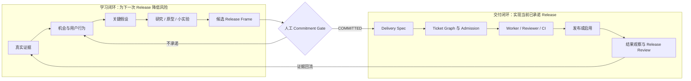

# 从产品意图到可验证结果：全阶段运行方案

> 状态：Phase 1–3、Gate C 内部 Release→Harness canary、显式流程分级、人类状态卡、统一 doctor 和真实模型 Release Gate 已实现；十四个只读 fresh-process PI 场景已通过，真实客户证据到 Outcome 的循环仍未完成
>
> 日期：2026-08-16
>
> 批准记录：用户于 2026-08-12 同意前十项决策，并于 2026-08-16 同意第 11–14 项。
>
> 入口修订：原第 5 项 `/to-release` 公开入口已由用户改为统一 `/skill:ask-yet`；Release 规则降为其内部 reference。完整设计见 [`ask-yet` 架构](./ask-yet-skill-architecture.md)。
>
> 本文只定义运行模型与演进顺序，不授权修改现有 Skill、Profile、标签或 HerdrHarness。
>
> 支撑证据见[《从产品发现到 AI 交付：一手工程实践证据综述》](../research/product-to-delivery-primary-practices.md)。

## 1. 决策摘要

建议继续以 **PI + `pi-ticket-planning`** 作为当前可运行宿主，同时把新增能力写成符合 Agent Skills 规范、尽量不依赖 PI 私有语义的 Skill。**现在不另建通用 Skill 包。**

原因不是 PI 永远最合适，而是当前缺口首先是产品方法是否有效，尚未证明是运行时复用问题。先建通用包会同时引入产品模型、包边界、兼容层和版本管理四类未知项，却没有第二个真实消费者验证这些抽象。

| 路线 | 现在的收益 | 主要代价 | 结论 |
|---|---|---|---|
| 继续写成 PI 专用能力 | 最快复用现有 Profile、subagent 和 GitHub 流程 | 产品规则会和 PI 运行语义耦合，未来难验证可移植性 | 不作为长期形态 |
| 现在新建通用包 | 表面上先获得独立边界 | 没有第二消费者，抽象、兼容和版本策略都属猜测 | 暂不做 |
| 同仓库 portable core + PI adapter | 继续真实运行，同时用 Agent Skills 契约约束核心 | 需要克制核心层不引用 PI 私有能力 | **当前采用** |

“portable core”目前只是编写约束，不新增目录或包：核心 Skill 只表达输入、产物、Gate 和 fixture；PI Profile、subagent、GitHub 标签/frontier 与 Harness 接线继续作为宿主适配。第二个 runtime 出现前，不为适配层搭脚手架。

目标流程是：

```text
真实证据
  → 产品机会与风险
  → 下一次 Release 的最小用户闭环
  → 人工承诺
  → Delivery Spec
  → 可执行 Ticket Graph
  → HerdrHarness 实现、审查与合并
  → 发布或启用
  → 观察真实结果
  → 继续、迭代、转向或停止
```

规划单位不是“完整成熟产品”，而是“**下一次能完成用户闭环并产生新证据的 Release**”。Roadmap 只保留方向和用户结果；只有已承诺的当前 Release 才进入详细 Spec 和 Ticket。

## 2. 这不是串行瀑布，而是两个并行闭环

产品发现与交付应由同一个产品责任主体持续负责，而不是移交给两个互不相干的团队。SVPG 对 continuous discovery / delivery 的界定也强调二者持续并行，而非先完成全部发现再开发。[SVPG: Discovery — Delivery](https://www.svpg.com/discovery-delivery/)



初始并发限制：

- 每个仓库同时只保留 **一个已承诺、正在交付的 Release**。
- 下一次 Release 可以并行做发现，但不能提前进入 `ready-for-agent`。
- 紧急故障、安全事件走独立快速通道，不伪装成普通产品 Release。

## 3. 网上实践中应采用、应调整和不应照搬的部分

| 实践 | 采用部分 | 本方案的调整 |
|---|---|---|
| Continuous discovery / dual track | 发现和交付持续并行；产品结果优先于功能产量 | 不设两个团队，也不增加固定仪式；同一责任主体维护两个闭环 |
| Opportunity Solution Tree | 从目标结果展开机会、方案和假设测试 | 只有存在真实访谈或观察证据时使用；AI 生成的“机会”只能标为假设，不能当用户事实 |
| User Story Mapping | 沿用户旅程组织行为，并先切出端到端 walking skeleton | 只用于多步骤、多角色的用户闭环；窄改动不强制画图 |
| Shape Up | appetite、先处理 rabbit holes、固定投入而可变范围、circuit breaker | 不照搬六周周期和 betting table；保留“投入上限 + 人工承诺 + 到期停损” |
| GitHub agent task guidance | Issue 是 agent prompt：问题清楚、AC 完整、范围可审 | 提供稳定代码锚点或查找线索，不强制预测所有待改文件 |
| Trunk-based development | 小批量、短生命周期分支、快速合并 | AI 变更仍必须走短生命周期 PR、独立 Reviewer 与 protected branch，不直接提交主干 |
| DORA | 同时观察吞吐与稳定性 | 看趋势，不把指标变成个人或 Agent KPI；没有持续部署时只用适用子集 |
| NIST SSDF / SLSA | 按风险保护源码、构建、依赖和来源证明 | 小项目先做 exact SHA、分支保护、依赖审查和构建来源记录，不虚称达到完整高等级 |
| Feature flags | 必要时解耦 deploy 与 release，并支持小范围启用 | 不是默认基础设施；只有用户可见且需渐进启用或实验时增加，并规定删除日期 |
| 多 Agent planner / evaluator | Writer 与 fresh-context Reviewer 分离，评测使用真实任务 | 当前 Worker/Reviewer 已足够；没有可观察失败前不增加更多常驻角色 |

依据包括 [Jeff Patton 的 Story Mapping 原始文章](https://jpattonassociates.com/the-new-backlog/)、[Product Talk 的 Opportunity Solution Tree](https://www.producttalk.org/glossary-discovery-opportunity-solution-tree/)、[Shape Up 的 shaping 原则](https://basecamp.com/shapeup/1.1-chapter-02)、[GitHub Copilot coding agent 最佳实践](https://docs.github.com/en/copilot/using-github-copilot/using-copilot-coding-agent-to-work-on-tasks/best-practices-for-using-copilot-to-work-on-tasks)和 [DORA 当前五项交付指标](https://dora.dev/guides/dora-metrics/)。

## 4. 统一语言与事实边界

| 名称 | 定义 | 不是什么 |
|---|---|---|
| Product Direction | 相对稳定的目标用户、核心工作、价值方向和硬约束 | 功能清单或多年 Ticket backlog |
| Evidence | 访谈、观察、日志、工单、业务数据、可复现实验等可追溯事实 | AI 推测、团队直觉或未经标注的摘要 |
| Opportunity | 用户在完成某项工作时出现的需求、痛点或期望结果 | 已经选定的功能 |
| Release | 一次有边界的产品赌注：为特定用户完成最小闭环并获取结果证据 | 一组碰巧同期开发的 Issue |
| Release Frame | Release 被承诺前的产品契约 | 技术实施 Spec |
| Delivery Spec | 已做出必要决定后，对可交付行为、约束和验证的描述 | 继续探索产品方向的容器 |
| Ticket | 一个新上下文 Agent 可独立完成、独立验证、形成易审 PR 的交付单元 | Epic、愿望或研究问题 |
| Output | 代码、PR、部署、文档等交付物 | 用户或业务结果 |
| Outcome | 发布后可观察的用户行为、任务结果或业务变化 | “所有 Issue 已关闭” |

每份材料中的内容必须显式区分：

- `FACT`：有来源的已观察事实；
- `ASSUMPTION`：尚待验证的判断；
- `DECISION`：由有权者做出的取舍；
- `UNKNOWN`：会影响下一步但尚无答案的问题。

AI 可以整理四类内容、指出矛盾和缺口，但不得把 `ASSUMPTION` 改写成 `FACT`。

## 5. 入口分流：不同工作不强行走同一条路

| 变更类型 | 识别信号 | 默认规划深度 / 路径 | 可跳过内容 |
|---|---|---|---|
| A. 新产品 / 重大产品赌注 | 新用户、新核心工作、价值不确定、跨多次 Release | `DISCOVERY`：完整发现 → Release Frame → Commitment → Spec → Tickets | 无 |
| B. 有界增强 | 用户和目标行为已有可信事实，但仍需 Spec 或多票 | `STANDARD`：Release-lite → Commitment → Spec → Tickets | 新证据动作、完整 OST、长期 Wayfinder map |
| C. Bug / Regression / 明确局部修改 | 已承诺行为可复现地失效，或一张独立 Ticket 已能完整表达 | `QUICK`：Source → 单 Ticket → fresh Readiness → Admission | Release、Spec、Delivery Parent 和 graph |
| D. 维护 / 安全 / 合规 | 依赖、漏洞、权限、平台迁移、高风险生产切换或强制控制 | 先按事实选 QUICK/STANDARD/DISCOVERY；高风险叠加 `CONTROLLED`：风险契约 → 验证/回滚 → Admission → 发布门禁 | 不适用的产品发现，但不能跳过实际风险门禁 |
| E. 研究 / 原型 | 目标是得到决定或证据，而非上线 | `DISCOVERY` 内的 Wayfinder / research / prototype → 决策记录 | 实现队列；结论前不得贴 `ready-for-agent` |
| F. 生产事件 | 正在影响用户、数据或安全 | `INCIDENT`：止血 → 证据保全 → 恢复 → 事后复盘；不进入普通 Tier | 常规 Release 节奏；不能跳过审计和恢复验证 |

`ask-yet` 先识别 `INCIDENT`，再自动选择能由权威事实证明的最浅 `QUICK | STANDARD | DISCOVERY` 规划深度，并独立叠加 `NORMAL | CONTROLLED` 风险控制，只用一句话解释决定性理由。人不选择档位，只纠正错误事实、做非委派决定并接受重大风险。无法证明短路径时默认 `DISCOVERY`；高风险不强制补做无关产品发现，但“Bug”标签和小 diff 也不能绕过适用的风险 Gate。

## 6. 权威产物：每个事实只有一个归属

| 产物 | 唯一负责内容 | 何时更新 | 明确不负责 |
|---|---|---|---|
| Product Context | 稳定的用户、核心工作、战略方向、长期约束 | 方向真正变化时 | 当前 Release 细节 |
| Evidence Log | 原始证据引用、采集方式、日期、局限 | 获得新证据时 | 替团队做决定 |
| Release Frame | 当前赌注、最小闭环、结果信号、appetite、非目标和关键风险 | Commitment 前；重大变更重新过门 | 实现文件和任务状态 |
| Repository policy | 稳定、跨票、无法从环境可靠发现的仓库 invariant、验证与安全规则 | Commitment 后影响检查确认需要；规则真正变化时 | 当前 Release、单票 AC 或未确认设计 |
| Wayfinder Map | 尚未解决且需跨会话推进的决策依赖 | 大型未知项出现或关闭时 | 普通实现 Ticket |
| Delivery Spec | 已决定的行为、约束、验证策略和未决 blocker | Release 已承诺后 | 产品优先级 |
| Ticket Graph | 实现单元、场景覆盖、真实阻塞关系 | Spec 稳定后 | 产品证据或发布结果 |
| PR / CI | exact diff、构建和测试证据 | 每个实现循环 | 产品是否成功 |
| Harness Ledger | Worker、Reviewer、SHA、状态迁移和失败事实 | 自动执行时 | 产品范围取舍 |
| Release Record | 发布 artifact、环境、SHA、迁移、启用与回滚事实 | 发布/回滚时 | 用户价值判断 |
| Outcome Review | 结果信号、护栏、证据质量和下一决策 | 证据窗口结束时 | 自动生成已准入 Ticket |

`Product Context` 初期不必新建独立文件：前两个真实 Release 可直接在 Release Frame 中保留稳定字段。只有重复出现、复制开始造成漂移时再抽出。这是刻意避免过早建模。

## 7. 全阶段运行契约

### G0：Intake 与分流

**输入**：一句需求、Bug、客户反馈、数据异常、技术债或强制变更。

**动作**：

1. 记录提出者、触发事件、预期变化和证据来源。
2. 按第 5 节自动推断 planning depth、control mode 和路径。
3. 判断是否为事件、安全或数据风险，必要时升级。

**退出条件**：工作类型、planning depth 与 control mode 明确；知道下一份应产生的产物；没有把未知产品问题直接塞进实现票。

**失败输出**：`NEEDS_TRIAGE`，而不是自动进入 backlog。

### G1：Product Context 与问题证据

**目标**：证明问题值得继续研究，而不是证明某个方案正确。

最低输入：

- 谁在什么情境下尝试完成什么工作；
- 当前行为路径或状态变化；
- 至少一个可追溯证据；
- 已知频率、影响和局限；
- 不做会发生什么。

新产品通常需要访谈、观察或原型证据；已有产品的小增强可以使用真实工单、行为日志和可复现场景。GOV.UK 的服务设计手册同样先要求理解用户、问题和约束，再在 alpha 阶段测试高风险假设。[GOV.UK Discovery](https://www.gov.uk/service-manual/agile-delivery/how-the-discovery-phase-works)

**Gate**：

- `EVIDENCE_SUFFICIENT`：足以定义一个待解决机会；
- `NEEDS_RESEARCH`：缺少用户或环境事实；
- `DROP`：影响不足、重复或不符合方向。

需要当前外部事实时，先固定 decision question、要求的一手来源、freshness、minimum evidence 和 blocking gate，再核对执行环境的真实能力。Web 搜索只用于发现来源；结论仍回到官方文档、规范、源码或第一方 API。没有搜索但能读取已知 URL、本地资料或人提供的原始文件时可以继续；完全无法取得要求的一手来源时输出 Research Handoff，保持 `NEEDS_RESEARCH`。模型记忆和 `summary-only` 转述不能关闭阻塞性 unknown。

### G2：机会、风险与关键假设

**目标**：先找最可能让 Release 失败的假设，而不是先扩展功能列表。

从四类产品风险检查：

- `VALUE`：用户是否需要，是否会采用；
- `USABILITY`：目标用户是否能完成；
- `FEASIBILITY`：当前技术、时间和能力是否可实现；
- `VIABILITY`：是否符合业务、法律、安全、运营和渠道约束。

这四类风险来自 [SVPG Four Big Risks](https://www.svpg.com/four-big-risks/)。再增加交付护栏：数据损失、权限扩大、不可逆外部副作用和恢复能力。

只对阻塞 Release 的高风险假设做研究或原型。低风险未知项可以记录后在实现中解决。

**何时使用 Wayfinder**：

- 未知项相互依赖；
- 需要多轮研究、原型或人工决策；
- 单次上下文不能可靠收口。

否则直接在 Release Frame 里列出一个待决项即可，不新建决策地图。

**Gate**：`NEEDS_RESEARCH | NEEDS_PROTOTYPE | NEEDS_DECISION | READY_TO_SHAPE | DROP`。

### G3：Release shaping

**目标**：形成下一次能端到端完成、能产生结果证据的最小 Release，而不是规划完整产品。

Release Frame 最低字段：

```yaml
release_id: Rxxx
status: CANDIDATE
actor_and_trigger: "谁在什么情境下开始"
observed_problem:
  facts: []
  evidence_refs: []
target_outcome: "用户能够完成或改善什么"
solution_hypothesis: "我们认为怎样的改变会带来该结果"
smallest_closed_loop: "触发 → 关键行为 → 可观察结果"
included_scenarios: []
non_goals: []
success:
  baseline: "当前信号或 unknown"
  primary_signal: "主要结果信号"
  guardrail: "不能恶化的信号"
  evidence_window: "何时复核"
  minimum_evidence: "什么证据才足以判断"
risks:
  value: []
  usability: []
  feasibility: []
  viability: []
appetite: "愿意投入的时间、成本或 Ticket 上限"
facts: []
assumptions: []
decisions: []
blocking_unknowns: []
false_positive_completion: "什么情况看似交付完成但实际不算成功"
```

对于多步骤用户旅程，补一张 story map，先切出贯穿全流程的 walking skeleton；对于窄改动，不创建形式化地图。

**Product readiness verdict**：

- `READY_TO_COMMIT`：有真实证据、最小闭环、可评估结果、关键风险和可接受 appetite；
- `NEEDS_RESEARCH`；
- `NEEDS_PROTOTYPE`；
- `NEEDS_DECISION`；
- `DROP`。

`READY_TO_COMMIT` 只是材料就绪，不代表已排期。

### G4：人工 Commitment Gate

这是产品优先级和风险接受的人工门。一个设计完善的 Release 仍可以选择“现在不做”。

承诺者检查：

1. 它是否符合当前 Product Direction；
2. 相比其他机会是否值得占用当前唯一交付槽位；
3. appetite 与关键风险是否可接受；
4. success signal 是否真能被观察；
5. 不做和做到一半各有什么后果。

输出只有：

- `COMMITTED`：冻结 Release Frame 修订号，允许进入 `to-spec`；
- `HOLD`：保留候选但不拆实现票；
- `REWORK`：退回指定未知项；
- `DROP`。

任何 scope、核心结果、风险接受或 evidence window 的重大变化都必须重新过此门。文案和非语义澄清不必重审。

`COMMITTED` 后、进入 Delivery Spec 前做 Repository Contract Impact Review。只有同时满足“稳定、跨票、无法从代码/配置可靠发现”的约束才进入生效的根级 policy；Release 行为和单票局部事实继续放在 Frame、Spec、ADR 或 Ticket。若当前交付依赖新 policy，该变更必须先单独合入目标基线，再从 exact base SHA 解析有效 path 和 digest。

### G5：Delivery Spec

已承诺 Release 才进入现有 `to-spec`。Delivery Spec 应把已做出的决定编译为：

- Problem statement；
- Delivery outcome；
- Behavioral scenarios；
- Decisions；
- Verification strategy；
- Constraints；
- Out of scope；
- Unresolved decisions。

新增约束不是扩写更多模板，而是建立可追溯关系：

```text
Release Frame revision
  → Scenario IDs
  → Delivery Spec behaviors
  → Ticket coverage
  → Release result signals
```

如果 Spec 过程中发现新的产品取舍，不由 `to-spec` 猜答案：退回 G3/G4。只有局部技术未知项可以进入 Wayfinder 或单独原型。

**Gate**：Spec 中没有阻塞实施的产品决定；行为和验证可被新的 Agent 理解；out-of-scope 清楚。

### G6：Ticket Graph 与 Admission

先做场景覆盖矩阵：

| Scenario ID | 用户可观察行为 | 入口 → 出口 / 交接 | Ticket | Primary verification | Release 信号关联 |
|---|---|---|---|---|---|
| S1 | … | 外部输入 → 状态或产物 | T1 | … | M1 |

矩阵必须满足：

- 每个纳入场景至少有一个实现 Ticket；
- 每个下游状态或产物都有显式的上游生产者或外部来源；
- 每个 Ticket 都服务于一个场景、验证能力或必需迁移步骤；
- 不存在没有场景归属的“顺便做”技术票；
- 第一条路径优先是 walking skeleton，而不是先铺所有基础设施；
- 依赖边只表达真实阻塞，不表达偏好顺序。

每个实现 Ticket 保持当前核心契约：

- 一个主要、可观察结果；
- 一个主要验收入口；
- starting state；Bug 包含复现；
- in-scope / out-of-scope；
- 行为型 AC、负向或回归场景；
- 不可破坏约束；
- 可运行的验证命令、环境和预期信号；
- 依赖与 blocker 已关闭；
- 对应 Release / Spec scenario；
- 稳定实现锚点或可靠搜索线索；
- 能独立形成易审 PR；
- 风险和人工升级条件。

当前“3–6 条 AC、最多 8 条、最多 3 个独立交付面”可继续作为本地拆票启发式，但不应宣称是行业定律；最终判断仍是能否由 fresh-context Agent 独立完成和验证。

DORA 的小批量资料给出“通常数小时至两天、超过一周往往过大”的方向性参考，但它不是 Agent Ticket 的工时 SLA。若一票多日不收敛，应优先检查未知决策、横向拆分、慢验证或 Harness 等待，而不是机械按天数切碎。

纯技术工作默认折进提供用户价值的纵向切片。只有 expand–migrate–contract、共享迁移或独立风险验证确实要求分步时才建技术 Ticket，并写清其下游消费者和退出条件。

Admission 保持 fail-closed：

```text
Ticket draft
→ strict frontier / topology check
→ fresh-context ticket-readiness review
→ exact snapshot
→ 人工确认
→ ready-for-agent
→ HerdrHarness
```

Reviewer 不采信作者的完成声明，只采信受信 Spec、固定 SHA/diff 和可复现检查。

Admission 是对当前候选和任务图的一次时间点审查。候选内容或任务图发生修改后重新 Admission；当前不增加额外封条或 Harness 侧交接协议。

Admission 激活只建立 `HANDOFF_READY`。Harness ledger 独占领取、执行、审查、恢复和终态事实；`pi-ticket-plan` 无常驻进程，只在再次调用 `ask-yet` 时按需重建状态。所有子票终态后的父票收尾、真实 audience enablement 和 Outcome evidence 分属后续三个独立事实门。

### G7：实现、审查与合并

完成链必须分层：

```text
Agent 生成 patch
→ Primary verification 通过
→ 相关回归与 CI 通过
→ fresh-context diff/spec Reviewer 通过
→ protected branch / required checks 满足
→ 风险对应的人类接受或预授权门
→ merge
```

其中：

- `worker completed` 只表示执行生命周期结束；
- `checks passed` 只表示指定检查通过；
- `review passed` 表示当前 diff 满足明确 Spec 且未发现阻塞问题；
- `merged` 不表示已发布；
- `released` 不表示产品结果已实现。

GitHub 要求 required checks 针对最新 commit SHA 成功，分支保护或 ruleset 不允许 Agent 自行绕过。[GitHub Required Status Checks](https://docs.github.com/en/pull-requests/how-tos/merge-and-close-pull-requests/troubleshooting-required-status-checks) 聚合 gate 还必须显式核对所有依赖 job 的结论，因为 `skipped` / `neutral` 可能被平台视为成功；“有一个 required check 名字”不自动等于 fail-closed。

单维护者仓库应诚实区分平台 approval 和产品接受：AI Review 不计入 GitHub required approval，作者也不能自批。L0/L1 变更可把人工 Commitment + Ticket Admission 作为有界预授权，在 CI 与独立 Reviewer 通过后使用原生 auto-merge；L2/L3 变更必须在 exact diff 或启用点再次取得明确人工决定。不要伪造第二位审批者。

Reviewer 只阻塞：明确需求违背、功能错误、回归、安全或数据损失风险、未经授权的范围扩张。风格偏好和假设性未来需求不能阻塞，以免 Reviewer 变成过度工程生成器。

### G8：发布、启用与恢复

Merge 后根据风险选择发布通道：

| 风险级别 | 典型变更 | 最低发布控制 |
|---|---|---|
| L0 | 文档、本地开发工具、无外部副作用 | 自动构建 + smoke check |
| L1 | 可逆的用户可见行为 | 自动部署；必要时分批启用或短期 flag；监测 guardrail |
| L2 | 数据迁移、外部写操作、权限或计费影响 | 备份/迁移验证/回滚方案 + 人工启用 + 发布后核对 |
| L3 | 破坏性、安全、合规、不可逆操作 | 显式批准、演练或双人复核、审计证据、明确停止条件 |

Release Record 至少记录：

- Release ID 和 committed frame revision；
- source SHA、artifact/build identity；
- 环境和启用范围；
- migration / flag 状态；
- smoke 和 health evidence；
- rollback 条件、结果和责任人。

供应链控制按风险渐进采用。NIST SSDF 是可裁剪的安全开发结果集；截至本文日期，1.1 是 final，1.2 仍是 draft。SLSA 当前规范为 1.2，提供逐级增强的 Source / Build 来源保证，但不证明代码正确或产品有价值；单人 + AI Reviewer 也不能声称达到要求两位可信人类的 Source 最高等级。[NIST SSDF](https://csrc.nist.gov/projects/ssdf)、[SLSA 1.2](https://slsa.dev/spec/v1.2/)

### G9：Outcome Review 与闭环

到 Release Frame 预设的 evidence window 后，由人主持复核：

1. baseline 是否有效；
2. primary outcome signal 如何变化；
3. guardrail 是否恶化；
4. 定量结果是否有定性证据解释；
5. 数据量、偏差或埋点问题是否让结论不可判断；
6. 哪些关键假设被支持或推翻。

结果判定：

- `ACHIEVED`；
- `PARTIAL`；
- `NOT_ACHIEVED`；
- `UNEVALUABLE`。

下一决策：

- `CONTINUE`：保留方向，候选下一个 Release；
- `ITERATE`：同一机会下调整方案；
- `PIVOT`：改变机会或方案方向；
- `STOP`：不再投入；
- `MEASURE_AGAIN`：仅限明确修复证据缺陷并给出新窗口。

Outcome Review 可以产生候选机会或草稿，但**不能自动创建 `ready-for-agent` Ticket**。新的工作仍从 G0/G3 和 Commitment Gate 进入。

## 8. 人、AI 与确定性自动化的权责

| 主体 | 应负责 | 不得替代 |
|---|---|---|
| 人 | 产品方向、证据解释、优先级、appetite、Commitment、重大风险接受、高风险启用、最终结果决策 | 不应逐命令微管低风险实现循环 |
| AI | 整理证据、发现矛盾、研究资料、生成原型、起草 Frame/Spec/Ticket、实现、独立审查、汇总结果 | 不得发明用户证据、决定优先级、把自己的声明当验收 |
| 确定性自动化 | schema、拓扑、fixture、测试、CI、branch rule、SHA、构建和部署健康事实 | 不得判断产品价值或含糊语义 |

Anthropic 的 harness 经验强调：长任务应有结构化进度产物、独立生成与评估，并只保留被实测证明“承重”的复杂度；过细的前置技术规划可能让早期错误级联。[Anthropic: Harness design for long-running application development](https://www.anthropic.com/engineering/harness-design-long-running-apps)

## 9. 度量体系：判断系统是否改善，而不是制造漂亮数字

### 9.1 产品结果

每个 Release 默认只选：

- 一个 primary outcome；
- 一个 guardrail；
- 必要的定性证据。

可从任务完成率、完成时间、错误率、留存/复用、支持请求或业务转化中选，但必须和目标用户行为直接相关。Google HEART 可用 goal → signal → metric 的方式帮助落地，不要求全套指标。[Google HEART](https://research.google/pubs/measuring-the-user-experience-on-a-large-scale-user-centered-metrics-for-web-applications/)

### 9.2 交付健康

有持续部署时观察 DORA 当前五项趋势：

- change lead time；
- deployment frequency；
- failed deployment recovery time；
- change fail rate；
- deployment rework rate。

没有真实部署时不伪造 deployment 指标，可先记录从 `COMMITTED` 到 merge/release 的时间和恢复事件。

### 9.3 规划质量

- `UNEVALUABLE` Release 比例；
- Ticket admission 返工次数；
- 场景覆盖缺口和 orphan Ticket 数；
- Commitment 后发生重大 scope/spec drift 的次数；
- 因缺失产品决定而阻塞的 Ticket 数。

### 9.4 Agent / Harness 质量

- first-pass verified rate；
- eventual verified rate；
- 每票 review / rework 轮次；
- automated pass 后被人工拒绝的比例；
- merge 后 reopen、rollback 或 regression；
- blocked / recovery 事件及原因。

不要把 LOC、关闭 Issue 数、Agent 会话数、Token 数或“velocity”当产品价值。任何指标都只看趋势和失败样本，不作为诱导刷数的个人目标。

## 10. `pi-ticket-planning` 的最小演进路线

### Phase 0：审核并建立基线

**状态：已完成。** 十项方案决策已于 2026-08-12 全部批准。

**完成内容**：审核本文的模型、术语、Gate 和权责。

**不做**：不新增 Skill，不改 Harness，不改现有标签，不建立新仓库。

**退出条件已满足**：第 12 节十个决策已获得批准。

### Phase 1：统一入口与首个真实 Release Pilot

**状态：进行中。** `ask-yet` Router 与内部 Release loop 已实现，并通过隔离 Profile、fresh-session 路由和只读恢复检查；真实产品证据循环尚未完成。第一个高不确定性候选是 Exposure-Agent 的“暴露面资产差异确认闭环”；既有手工 Frame verdict 为 `NEEDS_RESEARCH`，见 [`R001 Pilot`](../pilots/exposure-agent-r001-product-validation.md)。

该产品只是一项外部试验样本；其领域术语、事实和预期答案不进入 `ask-yet` 核心契约。

选择两个不同样本：

- 一个有产品不确定性的新增功能；
- 一个已有产品的有界增强。

用户通过 `ask-yet` 推进 Release Frame，达到 Gate 后再显式调用现有 `to-spec → to-tickets → admission → Harness`。保留：

- Frame 修订；
- 返工原因；
- Ticket coverage matrix；
- Commitment 后的 scope drift；
- Release outcome 是否可评估；
- 现有 Skill 重复询问或缺失的字段；
- 研究能力不足时 Handoff 是否可由另一个环境无歧义执行；
- repository policy impact review 是否减少单票隐含约束；

**通过标准**：至少两次都能在不让 `to-spec` 猜产品决定的情况下进入交付；每个 Ticket 能追溯到 Release scenario；缺研究能力时不伪造证据；repository policy 与局部事实分层清楚；Outcome Review 能给出非伪造结论。

**停止条件**：如果 Release Frame 没有减少返工，先修 Router 和模型，不增加更多 Skill、Reviewer 或自动化。

### Phase 2：`ask-yet` Gate A/B 用户前向测试

**状态：部分完成。** fresh-session 的入口、恢复、能力边界和人工 Gate 已有只读验证；真实产品样本的证据获取与 Human Commitment 仍待完成。

在 fresh PI session 中由用户亲自测试入口恢复、Lane/Stage 路由、产品证据和能力降级；观察者不把预期答案注入被测上下文。每次只修一个可重复失败。

至少覆盖：

1. 高不确定性功能在证据不足时停在 `NEEDS_RESEARCH`；
2. 无 Web/外部读取能力时生成 Research Handoff；
3. Commitment 后正确区分 repository policy 与 Release/Ticket 局部事实；
4. 只有 exact committed revision 才允许 `ask-yet` 自动进入 setup 或 `to-spec`。

连续两个 fresh session 通过 Gate A，且首个真实 Release 得到非伪造的 `READY_TO_COMMIT | REWORK | DROP` 后，再进入 Gate C。六类 fixture 只在两个真实样本暴露出稳定结构后冻结，不预写 expected result。

**明确跳过**：不增加第二套产品 Reviewer、不修改 HerdrHarness、不建立通用包、不自动生成全产品 Roadmap。

### Phase 3：v0.3，补已确认的交付接缝

**状态：已随 `v0.3.0` 发布。** 三档规划深度加风险覆盖、五字段人类状态卡、分层只读 `pi-ticket-plan doctor`、幂等 Admission plan/apply 和真实模型 Release Gate 已实现，并通过 package/Profile 检查、确定性回归和十四个全新 PI 进程行为评测。内部 canary 不替代客户价值证据。

用户审核后已确认实现以下最小门禁，而不是整包预建：

- `to-spec` 仅对 A/B 类产品变更要求引用 `COMMITTED` Frame；Bug/维护保留缩短路径；
- `to-tickets` 输出 scenario coverage matrix 和首个 walking skeleton；
- `admit-ticket` 的受信 bundle 增加 Release/Scenario 引用；
- 空仓库只有在 exact `COMMITTED` revision 后才能建立最小 Git/Tracker 交付基线；
- Admission、Harness、Git/PR、Release Record 和 Outcome signal 各自只裁决自己的事实；恢复无需 planning daemon；

仍不增加第二套产品 Reviewer、Receipt 或 Harness 协议；只有后续真实失败证明必要时再评估。

### Phase 4：v0.4，结果复盘

当至少三个 Release 到达 evidence window 后，才评估是否增加 `/release-review`：

- 固定读取 Release Frame 和 Release Record；
- 输出 `ACHIEVED | PARTIAL | NOT_ACHIEVED | UNEVALUABLE`；
- 输出下一决策草稿和证据缺口；
- 永远不直接创建或准入下一批 Ticket。

### Phase 5：决定是否抽取通用包

只有同时满足以下本地触发条件才抽取；这些是本项目的防过度设计门槛，不宣称是行业标准：

1. 至少五个真实 Release 完成了从 Frame 到 Outcome Review 的闭环；
2. 已记录的重复痛点来自 Skill 核心，而不是 PI Profile 或 GitHub 适配；
3. 至少一个 PI 之外的真实 Agent runtime 需要同一工作流；
4. 第二个 runtime 能通过同一组 fixture，且不需要复制核心规则；
5. 能清楚切分：portable core 与 PI/Profile/GitHub/Harness adapter。

满足后再决定是：

- 原仓库内提供 portable core + adapters；或
- 建独立通用包，由 `pi-ticket-planning` 依赖它。

在此之前，符合 Agent Skills 规范的 Skill 文件已经提供足够的可迁移性，独立仓库没有额外产品价值。

## 11. 主要失败模式与 fail-closed 动作

| 失败模式 | 识别信号 | 默认动作 |
|---|---|---|
| AI 发明用户需求 | 没有证据引用却出现肯定用户结论 | 标为 `ASSUMPTION`，退回 G1 |
| 流程错误降档 | 小 diff、Bug 标签或用户催促导致跳过产品/风险 Gate | 重新判定 QUICK/STANDARD/DISCOVERY 规划深度和 NORMAL/CONTROLLED 风险控制；短路径无法由事实证明时用 `DISCOVERY` |
| 一次规划完整产品 | 远期 Ticket 依赖多层未验证假设 | 保留 outcome roadmap，删除未承诺实现票 |
| 发现变成无限研究 | 未知项增加但没有 appetite / 决策点 | 只测最高风险假设；到 appetite 触发 `COMMIT/HOLD/DROP` |
| 研究环境能力不足 | 需要当前外部事实，但无搜索/访问/原始资料 | 输出 Research Handoff，保持 `NEEDS_RESEARCH`，不以模型记忆补证据 |
| Release 只是功能包 | 没有 actor、闭环或 outcome signal | 不允许进入 Commitment |
| Spec 替产品做决定 | `to-spec` 需要猜目标、取舍或价值 | 退回 Release Frame / 人工决策 |
| Ticket 横切过大 | 多个独立结果、验收入口或交付面 | 按纵向可验证结果拆分 |
| 技术票成为孤岛 | 没有 scenario / downstream consumer | 合并进切片或拒绝准入 |
| 自动测试产生假完成 | checks 通过但 review/真实场景失败 | 记录 false positive，补最小回归/eval，不扩大无关测试 |
| Reviewer 自我污染 | 实现票同时修改自己的 review policy | policy 变更单独高风险审查，从受信 base 读取规则 |
| Repository policy 沉积 | Release/单票事实或可发现命令不断写入根策略 | 仅保留稳定跨票约束，局部事实回到 Frame/Spec/Ticket |
| Merge 被当作 Release | 没有 artifact、环境、启用或 smoke 证据 | 状态保持 `MERGED_NOT_RELEASED` |
| Release 被当作 Outcome | 没到 evidence window 就宣布成功 | 只能记 `RELEASED_AWAITING_EVIDENCE` |
| Tracker 或 PR 被当作 Harness 状态 | ready/merged 存在但 ledger 无 claim 或 terminal | 以 Harness ledger 为准，保持 `HANDOFF_READY` 或 `BLOCKED` |
| 指标被游戏化 | 为提高数字而拆碎 Ticket 或频繁空部署 | 停止该指标作为目标，审查真实失败样本 |

## 12. 已批准的十四项决策

前十项于 2026-08-12 获得用户批准；第 11–14 项于 2026-08-16 获得用户批准。后续发生实质变更时重新审核：

1. **双闭环**：连续发现与当前 Release 交付并行，不采用串行阶段瀑布。
2. **Release 是规划单位**：Roadmap 写用户结果，只详细规划下一次已承诺 Release。
3. **人工 Commitment 必须存在**：`READY_TO_COMMIT` 不等于自动排期或拆票。
4. **初期单槽位**：每个仓库同时只有一个已承诺 Release；发现可并行，执行不抢跑。
5. **v0.2 只新增统一 `/ask-yet` 入口**：它负责从进入/恢复逐步路由到 Release、交付和 Outcome；原 `/to-release` 规则作为内部 reference，不再增加第二个公开入口。先用两个真实 Pilot 验证，不一次建立多 Skill、多 Reviewer 或改 Harness。
6. **Outcome 不自动变 Ticket**：复盘只产生候选与决策，必须重新走 Commitment / Admission。
7. **暂不建通用包**：继续 PI 宿主 + portable Skill core；五个闭环且出现第二个真实 runtime 后再决定抽取。
8. **研究能力 fail-closed**：外部研究先检查实际能力；缺少访问能力时输出标准 Research Handoff，阻塞性未知项保持 `NEEDS_RESEARCH`。
9. **Repository policy 分层**：根级 policy 只放稳定跨票约束；Commitment 后做影响检查，当前 Ticket 依赖的新规则必须先进入基线。
10. **简单交接**：Admission 使用 strict frontier、fresh review、exact Plan fingerprint、人工确认和可恢复 apply 写入 tracker ready 状态；graph 与 standalone QUICK 共用事务，逐标签更新、逐资源漂移检查，并在父任务或 standalone 激活前最终重读。不增加独立权威 Receipt、Harness 重算或 planning daemon，Plan 与 reviewed fingerprint 留在结果和幂等 comment。候选或任务图修改后重新 Admission，执行事实只读 Harness ledger。
11. **显式流程分级**：`ask-yet` 自动推断 `QUICK | STANDARD | DISCOVERY` 规划深度，再叠加 `NORMAL | CONTROLLED` 风险控制；用户只看到一句决定性理由。不增加公开 Quick Skill、状态机或 Reviewer，Readiness 继续复用 Admission 的 fresh reviewer。
12. **人类状态卡**：每轮用户界面固定为“当前目标、已经确认、仍然缺少、为什么现在不能继续、你只需要决定”；内部 lane、stage 和 verdict 只进入最后一行机器 `Checkpoint`。
13. **统一 doctor**：`pi-ticket-plan doctor` 只读检查安装/Profile、GitHub、版本和当前目标仓库的 Harness 就绪条件，并分别汇总 Planning、Admission、Release readiness；默认只有 Planning 阻塞影响退出码，发布或自动化可用 `--require admission|release|all` 收紧。依赖事实不足时使用 `SKIP`，可操作失败同时给出 `FIX`，不自动改仓库或授权状态。
14. **真实模型 Release Gate**：确定性 CI 只验证冻结 fixture 合同；package Release 必须从干净 checkout 运行固定十四个 fresh-process PI case，覆盖 `Frame → Evidence → Commit → Spec → Tickets → Readiness → Admission` 的相邻权威快照。只重试失败 case 一次，恢复记为 `FLAKY`，并记录语义失败、基础设施失败和成功率。提供三次 advisory 的 `eval:pi:nightly`；PR CI 不使用维护者个人 OAuth，仓库有专用 runner、机器凭据和非门禁评分合同后才接定时任务、无 Skill 基线和双能力档模型矩阵。

## 13. 一手资料索引

- 产品发现与风险：[SVPG Continuous Discovery](https://www.svpg.com/continuous-discovery/)、[Four Big Risks](https://www.svpg.com/four-big-risks/)、[Product Talk OST](https://www.producttalk.org/glossary-discovery-opportunity-solution-tree/)
- 用户行为与 Release slicing：[Jeff Patton Story Mapping](https://jpattonassociates.com/the-new-backlog/)、[GOV.UK Alpha](https://www.gov.uk/service-manual/agile-delivery/how-the-alpha-phase-works)
- shaping 与投入边界：[Shape Up — Shaping](https://basecamp.com/shapeup/1.1-chapter-02)、[Shape Up — Betting](https://basecamp.com/shapeup/2.2-chapter-08)
- AI coding agent 任务与审查：[GitHub Agent Best Practices](https://docs.github.com/en/copilot/using-github-copilot/using-copilot-coding-agent-to-work-on-tasks/best-practices-for-using-copilot-to-work-on-tasks)、[Anthropic Building Effective Agents](https://www.anthropic.com/engineering/building-effective-agents)、[SWE-bench](https://www.swebench.com/original.html)
- 交付、分支与部署：[DORA Metrics](https://dora.dev/guides/dora-metrics/)、[GitHub Pull Request Standardization](https://docs.github.com/en/pull-requests/reference/managing-and-standardizing-pull-requests)、[GitHub Deployment Environments](https://docs.github.com/en/actions/reference/workflows-and-actions/deployments-and-environments)
- 安全与供应链：[NIST SSDF](https://csrc.nist.gov/pubs/sp/800/218/final)、[SLSA 1.2](https://slsa.dev/spec/v1.2/)、[OWASP ASVS](https://owasp.org/www-project-application-security-verification-standard/)
- 结果度量：[Google HEART](https://research.google/pubs/measuring-the-user-experience-on-a-large-scale-user-centered-metrics-for-web-applications/)、[GOV.UK Measuring Success](https://www.gov.uk/service-manual/measuring-success/measuring-the-success-of-your-service)
