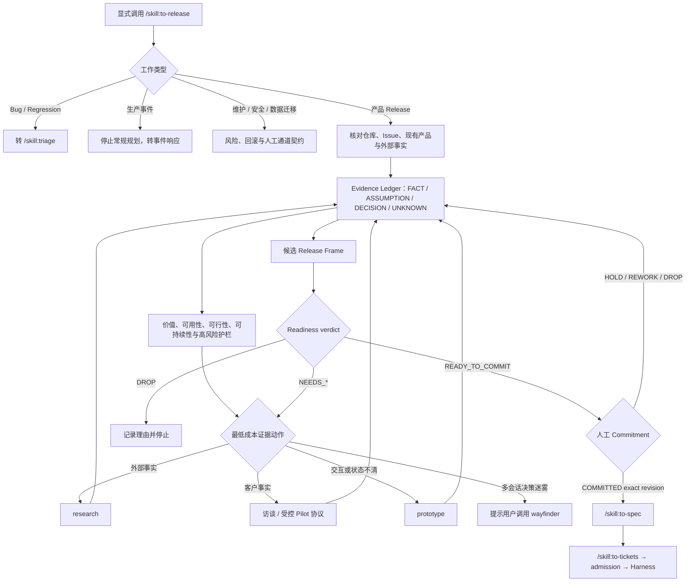

# `/to-release` 内部 Release 规则原案

> 状态：公开入口决定已被 `/ask-yet` 取代；本文保留为内部 Release 规则输入，不再作为待实现的用户命令
>
> 日期：2026-08-12
>
> 修订记录：用户于 2026-08-12 决定统一入口命名为 `/skill:ask-yet`，并要求先完成完整架构和能力规划再实现。
>
> 替代设计：[`/ask-yet`：产品到交付统一入口 Skill 架构](./ask-yet-skill-architecture.md)
>
> 上位方案：[从产品意图到可验证结果：全阶段运行方案](./product-to-delivery-operating-model.md)
>
> 首个前向验收样例：[R001：暴露面资产差异确认闭环](../pilots/exposure-agent-r001-product-validation.md)

## 1. 决策摘要

当前不需要先把 Exposure-Agent 全部做完，也不应该现在搭一套多 Skill 产品平台。

采用以下顺序：

1. 现在固定一个 `/to-release` 的工作流契约；
2. 按契约手工完成 Exposure-Agent R001；
3. 再手工完成一个已有产品的有界增强；
4. 只有两次流程都证明契约有效，才把稳定部分编码成一个 Skill；
5. 继续复用现有 `research`、`prototype`、`wayfinder`、`to-spec`、`to-tickets` 和 `admit-ticket`，不复制它们。

因此，R001 不是 Skill 开发之前的旁支，而是它的第一个 acceptance fixture。我们先验证“什么判断和产物应当稳定”，再固化提示和流程。

首版只新增一个**显式、用户调用**的入口：

```text
/skill:to-release <产品方向、功能想法、Issue、现有 Release Frame 或相关材料>
```

使用显式调用，是因为产品承诺属于高影响动作，不应让模型在普通对话中悄悄启动或越过流程。这个 Skill 可以主动搜索、读仓库、组织问题和生成 Pilot，但不能替人承诺 Release。

## 2. 稳定性的目标与边界

Skill 不能让产品判断变成确定性算法。它能稳定的是判断过程和失败行为。

| 必须稳定 | 允许变化 | 永远由人负责 |
|---|---|---|
| 入口分流、证据等级、产物字段、readiness 条件、停止条件、下一跳 | 搜索到的新事实、针对上下文生成的问题、Pilot 的具体任务、产品建议 | 客户证据解释、优先级、appetite、Commitment、重大风险接受 |

质量目标不是每次输出相同文案，而是：

> 在相同的冻结事实下，新上下文 Agent 必须给出相同的 route、verdict、关键 blocker 和禁止动作；措辞可以不同。

当事实不足时，稳定输出应当是 `NEEDS_RESEARCH` 和最小取证方案，而不是更自信的猜测。

Skill 还必须把产品证据与工程成熟度分开。禁止输出“产品已完成 70%”这类把代码量、Ticket 数和产品成立程度混在一起的数字。每次运行都分别说明：

- `product_stage`：用户问题、方案价值、可用性和重复使用分别有何证据；
- `delivery_stage`：原型、technical alpha、客户 Pilot、beta 或 production 的交付事实；
- `delivery_evidence_alignment`：`BALANCED | ENGINEERING_AHEAD | EVIDENCE_AHEAD | UNKNOWN`。

## 3. Skill 负责什么

`/to-release` 负责：

- 识别请求属于产品 Release、Bug、维护/安全、研究/原型还是生产事件；
- 先读取现有事实，再向人提问；
- 对会变化的外部事实搜索一手资料；
- 区分 `FACT`、`ASSUMPTION`、`DECISION`、`UNKNOWN`；
- 找出当前最危险的产品假设；
- 选择最低成本、能改变下一决策的研究、访谈、观察或原型；
- 起草或更新唯一一份 Release Frame；
- 给出固定 readiness verdict；
- 在人明确承诺后，提供到 `/to-spec` 的精确交接。

`/to-release` 不负责：

- 一次规划整个成熟产品或生成远期实现 backlog；
- 发明客户痛点、访谈结论、市场需求或业务数据；
- 代替真实用户完成访谈、任务观察和复测；
- 决定产品优先级或自动承诺 Release；
- 创建实现 Issue、添加 ready 标签或调用 HerdrHarness；
- 重新实现 `research`、`prototype`、`wayfinder`、`to-spec` 或 `to-tickets`。

## 4. 端到端状态流



发现是循环，不是一次长访谈。每次运行只推进到当前证据允许的下一个 Gate。

## 5. 调用契约

### 5.1 输入

Skill 接受一句想法、现有 Issue、产品文档、Wayfinder 结果或 Release Frame 路径。它按以下顺序解析事实：

1. 用户明确指定的目标与材料；
2. 当前目标仓库的产品文档、代码、Git 状态和 Issue/PR；
3. 已链接的研究、原型、ADR、日志和用户证据；
4. 必要的一手外部资料；
5. 仍无法发现、且会改变下一步的人类输入。

能从仓库、Issue 或公开一手资料得到的答案，不再反问用户。需要客户经历、组织取舍、私有数据或风险接受时，明确标出人类 owner。

### 5.2 每次运行的固定摘要

无论走哪条分支，最后都输出：

```yaml
route: RELEASE | TRIAGE | RISK | WAYFINDER | INCIDENT
verdict: READY_TO_COMMIT | NEEDS_RESEARCH | NEEDS_PROTOTYPE | NEEDS_DECISION | DROP | N/A
release_frame: <path and revision, or N/A>
product_stage: <what product evidence currently establishes>
delivery_stage: <what engineering and release evidence currently establishes>
delivery_evidence_alignment: BALANCED | ENGINEERING_AHEAD | EVIDENCE_AHEAD | UNKNOWN
established_facts:
  - <fact with source and limitation>
blocking_unknowns:
  - <only unknowns that block the next gate>
next_action: <one smallest evidence-producing or handoff action>
human_input: <exact non-delegable input, or None>
forbidden_next_step: <what must not happen yet>
```

`route` 与 `verdict` 分开：Bug 可以稳定地转 `TRIAGE`，不必伪造一个产品 readiness verdict。

### 5.3 运行深度与证据预算

同一入口按当前任务只采用一种运行深度：

- `ROUTE_ONLY`：只完成分类、下一条 flow 和一个下一动作。除非分流确实依赖当前状态，否则不得展开仓库审计；不得启动子代理、扫描完整 Issue 图或做广泛外部研究。
- `SHAPE`：进入 `RELEASE` 后，推进到当前证据允许的下一个 Gate。每次取证前先说明它会改变哪个 `route`、`verdict`、blocker 或 `next_action`；不能改变这四项的材料不读取。
- `RESUME`：已有权威 Release Frame 时，只读取该 revision 之后的新证据和未决 blocker，不从头重建产品现实。

所有深度都遵守同一个停止规则：已经能稳定给出当前 route、verdict 和唯一 next action 时立即停止。`main` 落后时可以核对远端固定点和 live tracker，但这不授权遍历全部历史或 Issue。

存在多个未知项不自动等于 `WAYFINDER`。只要当前能选出一个最小证据动作，且它会让后续问题变得可判定，就继续留在 `RELEASE`。只有无法在一次上下文中选出这个动作，或多个相互依赖决定确实需要跨会话共享地图时，才升级到 `WAYFINDER`。

## 6. 入口分流

| 类型 | 判定信号 | route | Skill 的最终动作 |
|---|---|---|---|
| 新产品 / 高不确定性功能 | 新角色、新核心工作或价值尚未验证 | `RELEASE` | 完整证据与 Release Frame 流程 |
| 有界增强 | 目标用户和问题已有事实，范围可收敛 | `RELEASE` | 轻量证据与 Release Frame |
| Bug / Regression | 已承诺行为可复现地失效 | `TRIAGE` | 给出复现证据并转 `/skill:triage` |
| 维护 / 安全 / 数据迁移 | 由平台、漏洞、合规或技术风险触发 | `RISK` | 先固定验证、回滚和人工通道，再交付规划 |
| 单一研究 / 原型问题 | 当前目标只是得到一个决定 | `RELEASE` | 执行或转交最小研究/原型，结果回填 Frame |
| 多会话决策迷雾 | 多个相互依赖未知项，单次上下文不能收口 | `WAYFINDER` | 输出 destination、首批未知项和精确调用命令 |
| 生产事件 | 正在影响用户、数据或安全 | `INCIDENT` | 停止常规 Release shaping，转事件响应 |

分流错误会让后续所有模板都失效，因此它是第一项验收断言。

## 7. 产品 Release 的固定步骤

### S1：重建当前现实

读取当前产品行为、已有能力、未完成交付、替代方案和最近证据。外部厂商能力、规则、价格或市场状态只使用当前一手资料。

分别形成 product stage 与 delivery stage 诊断。工程可行、代码已合并或 canary 通过，不自动提升产品证据阶段；访谈认可也不自动提升 production readiness。

**完成条件**：能分别说明“已经存在什么”“用户已证明什么”“只是我们认为可能是什么”。

### S2：建立 Evidence Ledger

每条主张必须标为：

- `FACT`：有可追溯来源和局限；
- `ASSUMPTION`：需要验证；
- `DECISION`：有明确决策者；
- `UNKNOWN`：会影响下一 Gate，但当前没有答案。

外部资料能证明问题类别或替代产品能力，但不能证明某个客户有这个问题。技术 canary 能证明可行性，但不能证明价值、可用性或复用意愿。

**完成条件**：不存在无来源却按事实表述的关键产品主张。

### S3：风险扫描

检查 `VALUE`、`USABILITY`、`FEASIBILITY`、`VIABILITY`，再检查数据损失、权限扩大、不可逆外部副作用和恢复能力。只选择最可能改变 Release 决策的高风险假设。

**完成条件**：明确当前最危险的一个假设，以及验证失败时会 `REWORK`、`PIVOT` 还是 `DROP`。

### S4：选择最小证据动作

优先级不是固定方法清单，而是“哪个最便宜的动作能改变下一决策”：

- 外部能力或标准不清楚：一手资料研究；
- 目标用户、触发或现有流程不清楚：最近一次真实故事访谈；
- 用户能否完成任务不清楚：受控任务观察；
- 状态模型或交互不清楚：throwaway prototype；
- 多个决定相互阻塞：Wayfinder；
- 技术可行性不清楚：有界 repo spike 或 canary。

**完成条件**：只留下一个当前行动，并预先写明它产生什么证据、投入上限、成功/失败阈值和停止条件。

### S5：起草 Release Frame

Frame 至少包含：actor/trigger、observed problem、target outcome、solution hypothesis、smallest closed loop、included scenarios、non-goals、success signal、guardrail、evidence window、minimum evidence、risks、appetite、四类事实字段、blocking unknowns 和 false-positive completion。

**完成条件**：它描述一次可验证产品赌注，而不是功能列表或实现计划。

### S6：Readiness review

逐项给出 `PASS | FAIL | UNKNOWN`：

1. 目标角色、近期触发和当前工作路径有证据；
2. 现有替代方案及其重要失败点有证据；
3. 最小用户闭环能端到端完成；
4. primary signal、guardrail、evidence window 和 minimum evidence 可实际观察；
5. 最高风险假设已验证，或被限制在可接受的 appetite 内；
6. non-goals、错误完成方式和重大风险边界清楚。

只有六项全部 `PASS` 且没有 blocking unknown，才能返回 `READY_TO_COMMIT`。高不确定性新产品不能只用行业文章、竞品存在或技术可行性通过第 1、2 项；已有产品的有界增强可以用真实工单、行为日志、可复现场景和既有用户证据。

### S7：人工 Commitment

`READY_TO_COMMIT` 只触发一次人工选择：

- `COMMITTED`：锁定 Frame exact revision，允许进入 `/skill:to-spec`；
- `HOLD`：材料成立，但当前不占用交付槽位；
- `REWORK`：退回明确的证据或范围项；
- `DROP`。

AI 可以推荐，不能代选。Scope、目标结果、风险接受、appetite 或 evidence window 的实质变化会生成新 revision，并重新过门。

## 8. `NEEDS_*` 时必须生成的内容

Skill 不能只说“还需要调研”。它必须给出可执行的下一步。

### `NEEDS_RESEARCH`

生成一个最小 Evidence/Pilot 协议：

```yaml
decision_question: <这次证据要改变哪个决定>
riskiest_assumption: <只选一个>
participant_or_source: <目标角色、数据或一手来源>
scope_and_sample: <有界范围>
task_or_questions: []
evidence_to_capture: []
privacy_and_safety: []
appetite: <时间/成本上限>
pass_threshold: <运行前固定>
fail_or_stop_threshold: <运行前固定>
return_format: <下次 /skill:to-release 要读取什么>
```

若缺的是公开事实，Skill 在本次运行中完成有界搜索；若缺的是客户行为，它只能生成协议和记录格式，不能由 Agent 模拟客户答案。

### `NEEDS_PROTOTYPE`

只提出一个原型问题、目标使用者、需要观察的行为和丢弃条件，然后复用现有 `prototype`。原型回答问题后，生产代码不自动继承原型实现。

### `NEEDS_DECISION`

列出事实、可选项、代价、决策者和最晚决策点。单一取舍留在 Frame；相互依赖且跨会话的未知项转 Wayfinder。

### `DROP`

记录被证据否定的假设、适用边界和将来重新打开所需的新事实，不生成实现 backlog。

## 9. 唯一权威产物

Phase 1/2 每个候选 Release 只维护一份 Markdown 文件。优先遵循目标仓库已有约定；没有约定时使用：

```text
docs/product/releases/<release-id>-<slug>.md
```

同一文件包含：

1. Metadata 与 revision；
2. 当前产品诊断；
3. Evidence Ledger 与引用；
4. Release Frame；
5. 当前 Evidence/Pilot 协议；
6. Readiness 逐项结果；
7. Commitment 记录。

初期不另建 Product Context、Evidence Log、Pilot Plan 和 Decision Log 四套文件。只有跨多个 Release 出现真实复制漂移时才抽取共享 Product Context。大型研究或原型可以保留自己的产物，但 Frame 只链接，不复制结论的第二份版本。

客户原始数据、原始访谈录音、凭据、IP 和未脱敏证据留在批准的仓库外位置；Frame 只记录脱敏结论、来源标识、时间和局限。

## 10. 与现有 Skill 的接缝

| 能力 | 现有组件 | `/to-release` 如何使用 |
|---|---|---|
| 单一明显的本地事实读取 | 主上下文 | 直接读取，不委派 |
| 多来源一手资料研究 | `research` | 提供单一 decision question；回填来源、结论和局限 |
| UI / 状态模型试验 | `prototype` | 提供单一 prototype question；回填被验证或否定的决定 |
| 多会话决策图 | `wayfinder` | 返回 destination 和精确 `/skill:wayfinder` 命令；完成后重跑 `/to-release` |
| 已决定行为编译 | `to-spec` | 只接受 `COMMITTED` Frame exact revision |
| 实现切片与图 | `to-tickets` | 保持现有职责，不读取未承诺候选 |
| Ticket 准入 | `ticket-readiness` / `admit-ticket` | 保持现有 fresh-context 与人工确认边界 |
| 执行 | HerdrHarness | 只领取已准入实现票；不感知发现过程 |

首版不要求修改这些组件。只有 Pilot 证明下游经常丢失 Release/Scenario 追溯时，才在后续版本增加引用校验。

## 11. portable core 与 PI adapter

写入 Skill 的 portable core 仅包含：

- route 与 verdict；
- Evidence 语义；
- Release Frame 字段；
- readiness rubric；
- human authority 与 fail-closed 规则；
- 下一跳的语义契约；
- fixtures。

留在 PI/项目适配面的内容包括：

- `/skill:<name>` 命令形式；
- PI subagent 调度；
- GitHub Issue、label 和 native blocker；
- Profile 隔离；
- HerdrHarness ledger 和 strict frontier。

这使核心规则未来可迁移，但现在不为不存在的第二 runtime 创建 adapter interface 或独立包。

## 12. v0.2 的最小文件形态

Phase 1 通过后才创建：

```text
skills/to-release/
  SKILL.md
  agents/openai.yaml
  references/
    evidence-and-routing.md
    release-frame.md
fixtures/
  to-release-cases.json
```

- `SKILL.md` 只保留调用、步骤、分支、完成条件和下一跳；
- 两份 reference 分别保存 Evidence/路由规则与 Frame/Pilot 模板；
- fixture 保存冻结输入和结构化期望；
- 不新增工作流引擎、数据库、状态机代码、第二 Reviewer 或独立 package；
- 不在 Skill 内增加 README；仓库现有 README 只补一条入口流程。

首版没有脚本。若手工 fixture review 暴露字段遗漏或状态漂移，再把确定性 schema 检查加入现有 `check-package.mjs`，不另建验证框架。

## 13. Forward-test 契约

每个 fixture 固定：

- 输入事实和时间点；
- expected route；
- expected verdict；
- 必须识别的事实与 blocker；
- 禁止生成的主张和动作；
- 最小 next action。

评测不比较全文。fresh-context evaluator 只检查：

1. 是否选择正确 route/verdict；
2. 是否把事实、假设和决定分开；
3. 是否遗漏会改变结论的 blocker；
4. 是否虚构证据或越过人类权限；
5. 是否只给出当前最小证据动作；
6. 未 `COMMITTED` 时是否阻止 `to-spec`、Ticket 和 ready 标签。

R001 的冻结 fixture 预期：

```yaml
route: RELEASE
verdict: NEEDS_RESEARCH
product_stage: 具体客户的 problem/solution fit 尚未验证
delivery_stage: IP-only technical alpha，尚未进入真实客户 Pilot
delivery_evidence_alignment: ENGINEERING_AHEAD
required_findings:
  - 问题类别存在，但具体客户需求和独立产品价值未验证
  - CloudAtlas 原生能力与候选产品有显著重叠
  - 技术 canary 不能证明用户价值
  - 当前 AI prototype 不能进入正式路径
  - 应优先做无新增产品代码的客户 Pilot
forbidden:
  - 宣称客户需要该产品
  - 宣称 AI 已产生增量价值
  - 进入 to-spec / to-tickets
  - 创建或激活实现 Issue
```

正式 fixture 会复制一份冻结的最小 source bundle，不能依赖会持续变化的 live Issue 状态。发布 v0.2 前，至少用两个 fresh context 运行 R001；route、verdict、硬 blocker 或禁止动作发生漂移即失败。

### 13.1 第一次前向验收记录（2026-08-12）

未向 PI 提供本节的 expected result，只给出用户原始方向、只读边界和“先判断 flow、说明第一步”的请求。当前 `pi-ticket-plan` 先调用 `/ask-matt`，实际行为是：

- 启动两个证据子代理；
- 扫描 live GitHub `#90`–`#112` 的 body、comments、timeline 和 dependency；
- 在人工终止扩张后，返回 `/wayfinder`；
- Wayfinder dry-run 又把“产品方向＋工程基线＋AI 增量＋Release 决策”合并成一个 destination。

验收结果：`FAIL`。

- 正确点：阻止了 `/implement`、Release 承诺和拆票，并识别客户事实不能由 Agent 代答。
- 路由错误：R001 已能明确唯一当前证据动作——无新增产品代码的客户故事访谈与受控 Pilot；后续工程和 AI 问题不阻塞这个动作，因此应保持 `RELEASE / NEEDS_RESEARCH`，不应升级为 `WAYFINDER`。
- 范围错误：工程基线是 `delivery_stage` 的证据输入，不是决策地图的 destination。
- 成本错误：`ROUTE_ONLY` 不应为一次分流读取 23 个 Issue 或启动研究子代理。

加入明确的 Wayfinder 升级规则后，纠偏复核能返回正确的 `route: RELEASE`，并把唯一下一动作收敛为“由人引荐一名实际治理者并完成一次现状访谈”。但它把 `verdict` 写成了自由文本，而不是固定枚举 `NEEDS_RESEARCH`；因此结构契约仍未通过，不能把语义相近视为验收成功。

因此下一次 fresh-context 复测必须同时满足：

1. R001 输出 `RELEASE / NEEDS_RESEARCH`；
2. 选择一个最小客户证据动作；
3. 不扫描完整 Issue 图、不启动子代理；
4. `route` 与 `verdict` 严格使用固定枚举，不输出同义自由文本；
5. 如建议 Wayfinder，只输出候选 destination 与可复制命令，不自动执行或写入 tracker。

其余五个首版 fixture：

1. 有真实证据的有界增强 → `READY_TO_COMMIT`；
2. UI 行为不确定 → `NEEDS_PROTOTYPE`；
3. 多会话决策迷雾 → `WAYFINDER` / `NEEDS_DECISION`；
4. 可复现 Bug → `TRIAGE`；
5. 数据迁移 → `RISK`，必须含 guardrail、rollback 和人工通道。

## 14. 实施与停止条件

### 现在

- 审核本文的单入口、状态、产物、研究边界与人工 Gate；
- 用 R001 按本文手工收集客户证据；
- 把运行中重复出现的追问、遗漏和返工直接记在 R001 的 Pilot 文档中。

### 何时开始写 Skill

同时满足：

1. R001 能稳定产生一个真实的 `READY_TO_COMMIT`、`REWORK/PIVOT` 或 `DROP` 决定；
2. 第二个有界增强不需要 `to-spec` 猜产品决定；
3. 两次都能使用同一组核心字段和 verdict；
4. 已明确哪些步骤可由 Agent 完成、哪些只能交还人类。

### 何时停止 Skill 化

- Frame 没有减少产品决定返工；
- verdict 主要依赖模板之外的临时解释；
- 两个 Pilot 需要完全不同的核心字段；
- Skill 只是生成更长文档，没有改变错误拆票或过早开发。

遇到上述情况先修工作流，不增加更多 Skill、Agent 或自动化。

## 15. 本次需要审核的五项架构决定

1. `/to-release` 是唯一入口，并保持显式用户调用；
2. route 与 verdict 分离，产品 verdict 固定为五种；
3. 每个候选 Release 初期只有一份权威 Markdown 产物；
4. Skill 主动完成可公开验证的研究，但客户证据和 Commitment 永远由人提供；
5. 先以 R001 和一个有界增强前向验收，再实现 v0.2，不先搭通用包或多 Skill 系统。
