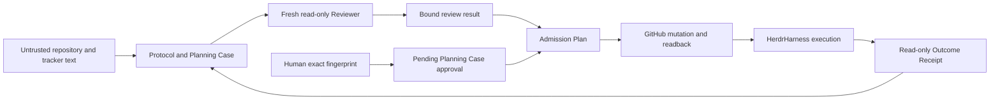

# Threat model

## Overview

`pi-ticket-planning` is a local planning and Admission package. It projects
repository and tracker data into versioned facts and Plans, stores recoverable
Planning Cases outside target repositories, obtains an independent Reviewer
result, and applies only an exact human-approved tracker mutation. HerdrHarness
owns execution; this repository only ingests its results.

| Component | Security role | Source evidence |
| --- | --- | --- |
| Protocol kernel | Registry, Fact, transition, identity, and mutation checks | `protocol/kernel.mjs:158`, `protocol/kernel.mjs:229`, `protocol/kernel.mjs:388` |
| Planning Case store | Private state, locks, event chain, transaction recovery | `planning-case/store.mjs:270`, `planning-case/store.mjs:412`, `planning-case/store.mjs:645` |
| Reviewer transport | Exact projected bytes and no-link held descriptor | `admission/review-transport.mjs:262`, `admission/review-transport.mjs:284` |
| Admission apply | Kernel authorization, exact Plan, claim checks, writes, approval consumption, and readback | `admission/apply.mjs:89`, `admission/apply.mjs:150`, `admission/apply.mjs:244` |
| GitHub adapter | Validated target and authenticated comment readback | `admission/github-adapter.mjs:16`, `admission/github-adapter.mjs:56` |
| Capability Doctor | Static vs active evidence and expiring receipt | `capabilities/doctor.mjs:14`, `capabilities/doctor.mjs:412` |
| Installer | Dry-run plan, contained writes, backup and exact rollback | `installation/manager.mjs:86`, `installation/manager.mjs:136`, `installation/manager.mjs:176` |
| Live E2E guard | Exact disposable repo and run-bound confirmation | `integration/e2e.mjs:24`, `integration/e2e.mjs:67` |

Effective resources differ by workflow:

| Deployment or workflow | Resource or capability | Configuration and precedence | Safe effective value or location | Recipients | Enforcing control | Evidence or unknowns |
| --- | --- | --- | --- | --- | --- | --- |
| Planning session | Case state | `PI_TICKET_PLAN_STATE_DIR`, then local-state default | Private state root, never target repo | Planner process | Store containment and modes | Same-account compromise is outside the filesystem-mode guarantee |
| Reviewer | Input bytes | Materialized descriptor and child-only extension | One digest-named 0600 file | Fresh Reviewer only | Held descriptor and allowlisted read | Real Provider behavior needs active probe |
| Admission | GitHub writes | Exact Plan plus refreshed context | Named repo/Issue operations only | GitHub API | Adapter validation and readback | App-auth identity handling remains deployment-dependent |
| Live E2E | Disposable writes | Enable flag, exact allowlist, run token | Tagged dedicated repository resources | Test GitHub account | Three-part guard and cleanup | No current live adapter/report is qualified |

## Threat Model, Trust Boundaries, and Assumptions

Protected assets are human Commitment and Admission authority, exact source and
Plan identities, ready labels/comments, private Case/Profile metadata, Provider
and Harness configuration, and the integrity of recovery evidence.

Realistic attackers may control Issue/README/AGENTS/Skill text, candidate bodies,
model output, malformed artifact files, network responses, or a low-privilege
contributor account. They do not initially control the operator account, private
state root, authenticated GitHub token, Provider account, Harness config, or
accepted base. A same-account local attacker can rewrite unkeyed local files;
0700/0600 and digest chains detect accidents and cross-path substitution but are
not a cryptographic defense against that attacker.

Security objectives are fail-closed unknown majors, one authority owner per
fact/rule, exact target/subject/revision/digest binding, fresh independent review,
single-consume approval, no mutation before evidence, parent-last activation,
post-write proof, recoverable local transactions, no credential persistence,
and no automatic Outcome-to-Kernel promotion.

## Attack Surface, Mitigations, and Attacker Stories

These are hypotheses for review, not confirmed vulnerabilities.

| Priority | Scenario and capability gain | Prerequisites | Impact | Existing controls | Mitigation | Evidence |
| --- | --- | --- | --- | --- | --- | --- |
| P0 | Replay or substitute an approval to activate another Plan | Attacker can inject a Fact or stale Case state | Unauthorized ready labels | Exact subject, expiry, kernel check, and consumed approval event | Keep operator approval bound to one Plan digest and target Case | `admission/apply.mjs:89`; `protocol/kernel.mjs:394`; `planning-case/store.mjs:195` |
| P0 | Drift Tracker data during partial apply | Concurrent Issue/label/body change or lost response | Wrong Issue state presented as admitted | Pre-read, per-write readback, final readback, claim detection | Preserve `PARTIAL/CONFLICT`; rebuild after drift | `admission/apply.mjs:113`; `admission/apply.mjs:233` |
| P1 | Prompt injection produces a false READY | Attacker controls candidate or policy text | Reviewer content influences Plan | Fresh context, projected input, binding echo, deterministic checks | Require active Reviewer capability and reject malformed binding | `extensions/ticket-readiness-read-guard.mjs:45`; `admission/review-transport.mjs:284` |
| P1 | Path/Symlink swap reads or overwrites another file | Local access to state/temporary path | Confidentiality or state corruption | Containment, no-follow open, inode/link/mode checks | Keep state local; fail on any unsafe metadata | `planning-case/store.mjs:412`; `admission/review-transport.mjs:262` |
| P1 | Forge Harness/Provider capability from config presence | Attacker supplies self-consistent JSON | Unsafe Admission proceeds | Producer/digest/freshness validation; runtime-only support needs active evidence | Qualify exact tuples and expire receipts | `capabilities/doctor.mjs:14`; `capabilities/doctor.mjs:92` |
| P2 | Marker injection makes an attacker comment look applied | Contributor can comment on Issue | Idempotency/readback bypass | Exact body plus authenticated author match | Pin app identity where app auth is used | `admission/github-adapter.mjs:56` |
| P2 | Accidental live E2E targets a real repository | Operator enables integration with wrong target | Unintended test writes | Enable flag, exact allowlist, run confirmation, resource tag | Dedicated account/repo and retained cleanup command | `integration/e2e.mjs:67` |
| P2 | External error leaks credentials into receipt/log | Tool returns credential-bearing stderr | Token disclosure | Structured codes and credential-shaped redaction | Keep raw output out of artifacts; rotate on exposure | `admission/apply.mjs:112` |

## Severity Calibration

- **Critical:** an unauthenticated or repository-text attacker can cause an
  arbitrary cross-repository mutation or extract operator credentials. A model
  returning READY without write authority is not Critical.
- **High:** a contributor can replay human approval, bypass exact Plan binding,
  forge a trusted Harness/Reviewer receipt, or escape the private state root to
  gain new write/read capability.
- **Medium:** a realistic race can misclassify a partial mutation as complete,
  an authenticated untrusted comment satisfies readback, or logs expose a
  limited-scope token. Exact conflict detection or mandatory re-approval lowers
  severity.
- **Low:** self-only denial of service, verbose non-secret paths, or a failure
  that remains `BLOCKED/UNTESTED` with no authority gain.

Confidence in deterministic local controls is supported by L1 tests. Provider,
real GitHub, Harness, cleanup, and release thresholds remain unqualified until
their L2-L4 reports exist.
